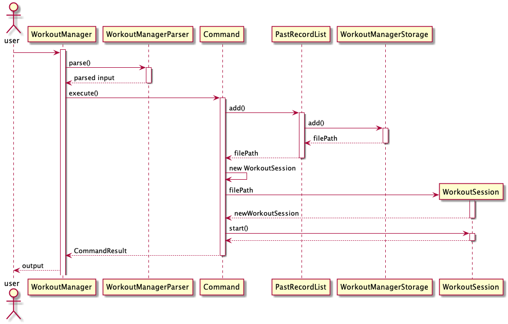

# Developer Guide
By: `CS2113T-F11-1` Since: `2020`

  


- [Developer Guide](#developer-guide)
  * [1. Introduction](#1-introduction)
    + [1.1. Background](#11--background)
    + [1.2. Purpose](#12-purpose)
    + [1.3. Scope](#13-scope)
  * [2. Setting up](#2-setting-up)
    + [2.1. Prerequisites](#21-prerequisites)
    + [2.2. Setting up the project in your computer](#22-setting-up-the-project-in-your-computer)
  * [3. Design](#3-design)
    + [3.1. Architecture](#31-architecture)
    + [3.2. Ui Component](#32-ui-component)
    + [3.3. Logic Component](#33-logic-component)
    + [3.4. Model Component](#34-model-component)
    + [3.5. Storage Component](#35-storage-component)
    + [3.6. Common Classes](#36-common-classes)
  * [4. Implementation](#4-implementation)
    + [4.1. Main menu-related Features](#41-main-menu-related-features)
    + [4.2. Profile-related Features](#42-profile-related-features)
      - [4.1.1. Addition of ingredient](#411-addition-of-ingredient)
      - [4.1.2. List all/ specific ingredient(s)](#412-list-all-specific-ingredients)
      - [4.1.3. Delete specific ingredients(s)](#413-delete-specific-ingredientss)
      - [4.1.4. Search for ingredients based on keyword(s)](#414-search-for-ingredients-based-on-keywords)
      - [4.1.5. Notification for ingredients warning](#415-notification-for-ingredients-warning)
    + [4.3. Diet-related Features](#43-diet-related-features)
      - [4.2.1. Addition of recipe](#421-addition-of-recipe)
      - [4.2.2. List all/ specific recipe(s)](#422-list-all-specific-recipes)
      - [4.2.3. Cooking of recipe](#423-cooking-of-recipe)
      - [4.2.4. Delete a specific recipe](#424-delete-a-specific-recipe)
      - [4.2.5. Search for recipe based on keyword(s)](#425-search-for-recipe-based-on-keywords)
    + [4.4. Workout-related Features](#44-workout-related-features)
      - [4.4.1. Creation of new workout session](#441-creation-of-new-workout-session)
      - [4.4.2. Listing past workout sessions](#442-listing-past-workout-sessions)
      - [4.4.3. Editing of workout session](#443-editing-of-workout-session)
      - [4.4.4. Deletion of workout session](#444-deletion-of-workout-session)
      - [4.4.5. Search based on conditions](#445-search-based-on-conditions)
    + [4.5. Recommendations-related Features](#46-recommendations-related-features) 
      - [4.5.1. Display expenditure](#451-display-expenditure)
      - [4.5.2. Expenditure functionality](#452-expenditure-functionality)
    + [4.6. Storage](#46-storage)
      - [4.6.1. Storage for Profile](#461-save-user-profile)
      - [4.6.2. Storage for Diet](#462-save-diet-session)
      - [4.6.3. Storage for Workout](#463-save-workout-session)
    + [4.7. Logging](#47-loggingToBeDeleted)
  * [Appendices](#appendices)
    + [Appendix A: Product Scope](#appendix-a-product-scope)
    + [Appendix B: User Stories](#appendix-b-user-stories)
    + [Appendix C: Value proposition - Use cases](#appendix-c-value-proposition---use-cases)
    + [Appendix D: Non-Functional Requirements](#appendix-d-non-functional-requirements)
    + [Appendix E: Glossary](#appendix-e-glossary)
    + [Appendix F: Instructions for Manual Testing](#appendix-f-instructions-for-manual-testing)
      - [F.1. Launch and Shutdown](#f1-launch-and-shutdown)
      - [F.2. Add an ingredient](#f2-add-an-ingredient)
      - [F.3. List ingredient](#f3-list-ingredient)
      - [F.4. Delete an ingredient](#f4-delete-an-ingredient)
    + [Appendix G: Supported Formats of Date Input](#appendix-g-supported-formats-of-date-input)

## 1. Introduction
### 1.1.  Background
The Schwarzenegger is a desktop command line interface-based app for managing all your needs regarding fitness. If you can type fast, The Schwarzenegger can help you maximise your efficiency for maintaining fitness.
### 1.2. Purpose
The document contains the specified architecture and software design specifications for the application, The Schwarzenegger. 
### 1.3. Scope
This describes the software architecture and software design requirements for The Schwarzenegger. This guide is mainly for developers, designers and software engineers that are or going to work on The Schwarzenegger. 

[&#8593; Return to Top](#developer-guide)

## 2. Setting up

### 2.1. Prerequisites
1. JDK `11`.
2. IntelliJ IDE.

### 2.2. Setting up the project in your computer
1. Fork this repository, and clone the fork to your computer.
2. Open Intellij (if you are not in the welcome screen, click `File` > `Close Project` to close the existing project dialog first).
3. Set up the correct JDK version for Gradle  
   1. Click `Configure` > `Structure for New Projects` and then `Project Settings` > `Project` > `Project SDK`.
   2. If `JDK 11` is listed in the drop down, select it. Otherwise, click `New…` and select the directory where you installed `JDK 11`.
   3. Click `OK`.
4. Click `Import Project`.
5. Locate the `build.gradle` file and select it. Click `OK`.
6. Click `Open as Project`.
7. Click `OK` to accept the default settings if prompted. 

[&#8593; Return to Top](#developer-guide)

## 3. Design
This section provides a high level overview of our application, The Schwarzenegger.
### 3.1. Architecture


The image above explains the design of the application, The Schwarzenegger. 

The main driver of the application is `Main: Kitchen Helper`. It is responsible for mainly two phases:
- At application launch
    - This class will initialise the components in the correct sequence and is in charge of connecting them with each other.
- At shut down
    - This class will invoke cleanup method for the components when necessary.
    
In addition to that, the architecture of Kitchen Helper is broken down into seven classes, mainly the following: 
- `Ui`: This class mainly handles the UI of the application.
- `Parser`: This class mainly handles the parsing and handling of user commands.
- `Command`: This class handles the type of command.
- `Ingredient`: This class manages the data of data type ingredient in memory.
- `Chore`: This class manages the data of data type chore in memory.
- `Recipe`: This class manages the data of data type recipe in memory.
- `Storage`: This class reads data from and writes data back into a text file for future uses.

[&#8593; Return to Top](#developer-guide)

### 3.2. Ui Component


API: `Ui.java`
 
The `Ui` component is a singleton class where all interaction will be made through this component
 
The `Ui` component,

* Executes user commands using the command component
* Listens for changes and outputs messages from the Command component

[&#8593; Return to Top](#developer-guide)

### 3.3. Logic Component


1. `Kitchen Helper` uses `Parser` class to parse the user command.
2. This results in a command object return back which is executed by `Kitchen Helper`.
3. The command execution can affect the object (e.g. adding an ingredient).
4. The result of the command execution is encapsulated as a `CommandResult` object which is passed back to `Ui` to display the message.

[&#8593; Return to Top](#developer-guide)

### 3.4. Model Component


The Model component contains `Ingredient`, `Recipe` and `Chore` classes, which store the user's input in Kitchen Helper.
* Ingredient: Stores the ingredient data.
* Recipe: Stores the recipe data.
* Chore: Stores the chore data.

[&#8593; Return to Top](#developer-guide)

### 3.5. Storage Component


A Storage object is created by the KitchenHelper class to handle the loading and saving of ingredients, recipes, chores and expenditure data.

The Storage() method acts as a constructor with filepaths to local save files for ingredients, recipes, chores and expenditure data.

The getIngredientData(), getRecipeData(), getChoreData() and loadExpenditureData() methods are used to read saved data from local files into the current session of KitchenHelper. loadingIngredients() and loadingRecipeItems() methods are called in getIngredientData() and getRecipeData() respectively to sort out which Ingredient object class each object belongs to.

The saveIngredientData(), saveRecipeData(), saveChoreData() and saveExpenditureData() methods write the current state of KitchenHelper into the local save files by calling them in various command classes such as AddChoreCommand and DeleteIngredientCommand.

[&#8593; Return to Top](#developer-guide)

### 3.6. Common Classes 
Classes used by multiple components are in the `seedu.duke` package.

[&#8593; Return to Top](#developer-guide)

## 4. Implementation
This section describes some details on how the features are being implemented. All recipe/ ingredient/ chore-related features can be broken down into 4 distinct functionality, addition, listing, deletion and searching.

### 4.1. Main-page Features

####4.1.1. Help Command for Main Page

The help command allows users to view all the available commands in the main page.
The command for help is `help`.

####4.1.2. Redirection to profile manager

The redirection to profile page allows the user to enter profile manager to create, edit, list and delete user profile.
The command for this redirection is `profile`.

####4.1.3. Redirection to diet manager

The redirection to profile page allows the user to enter diet manager to create, edit, list and delete diet sessions.
The command for this redirection is `diet`.

####4.1.4. Redirection to workout manager

The redirection to profile page allows the user to enter workout manager to create, edit, list and delete workout sessions.
The command for this redirection is `workout`.

### 4.1.Profile-related Features
#### 4.1.1. Addition of ingredient

The addition of the ingredient feature allows the user to keep track of the ingredients in the ingredient’s list.   
For example, `addingredient /n beef /c meat /q 2 /p 20 /e 18/02/2020` will add the ingredient `beef` 
which have the following attributes:  category `meat`, quantity `2`, price `$20` and expiry `18/02/2020`  

##### Implementation

 

The following steps explained “Sequence diagram for an example `addingredient` command”:  
1. The user enters `addingredient /n beef /c meat /q 2 /p 20 /e 18/02/2020`.  
2. `KitchenHelper` calls `Parser#parseUserCommand()`.  
3. `Parser#parseUserCommand()` will call its own method `Parser#prepareAddIngredient()`.  
4. `Parser#prepareAddIngredient()` will first validate the attributes and create an object `AddIngredientCommand` with the attributes if successful.  
5. `KitchenHelper` calls it own method `executeCommand()` to execute the method in `AddIngredientCommand#execute()`.  
6. On `AddIngredientCommand#execute()`, ingredient is added and return of the message.  

[&#8593; Return to Top](#developer-guide)

#### 4.1.2. List all/ specific ingredient(s)
The list feature allows showing details of Ingredients added by the user.  All ingredients added will be shown in a sorted order, by expiry, and shown by categories. The function will require a valid string , which belongs to `all/dairy/drink/fruit/meat/miscellaneous/staple/vegetable`, 
to be added as a parameter. Failure to do so will trigger an exception where the user will be notified of an invalid command and the syntax of the listing of the ingredients will be displayed. 

##### Implementation
When the user attempts to list the details of a particular category of ingredients, the `listIngredientCommand`, ‘Parser’ and `Ingredient` class will be accessed and the following sequence of actions are called to list details of  a particular category Ingredient list: <br>
The following image below shows the sequence of steps for step 1 and 2:

1. User executes `listingredient all` 
    2. A `Ui` object will be created and calls `Ui#getUserCommand()`
    3. Input will be parsed in `Command#parseUserCommand()` and identified with the keyword `listingredient`.
    
2. Parsing of user input and creation of command object
    2.This will automatically trigger the parsing of the user’s input string into a suitable format for the listing of a particular category of  `ingredient` object in `Command#prepareListIngredient()`.
    3. A `ListIngredientCommand` object will be created.
       
3. Executing Command
    The following image below shows the sequence for the next steps:
    
    
    2. The newly created object will call `#ListIngredientCommand#execute` which starts the process of listing a particular category’s ingredient details, thus calling `ListIngredientCommand#listIngredients()`.
    3. The existing ingredientList arraylist and the category of the chosen ingredient category  will be passed through to the `ListIngredientCommand#listIngredients()`.
    4. The function will find if the category name is valid, thus, creates `CommandResult` result storing the details of the ingredient belonging to the particular category.
    
4. The details will then be printed onto the console using `Ui#showResultToUser(result)`.
    
The following shows the full sequence diagram for this command:


##### Design Considerations
Aspect: Finding the category name and print out ingredient belonging to the category

Alternative 1: Looping through the whole ingredientList arraylist to find out all possible category name, then, do sorting and return result

|     |     |
|-----|-----|
|**Pros** | The program will be able to detect all category name inside the ingredientList arraylist. |
|**Cons** | This method will be slow when facing a huge amount of data in the arraylist as the program may have to go through every single item in the arraylist. |

Alternative 2 (current choice): Creating a fixed array which includes the order and all possible category names.

|     |     |
|-----|-----|
|**Pros** | Users would be able to get the details of the particular recipe accurately and fast. |
|**Cons** | Program will not be able to handle any ingredient which isn’t belonging to the category names in the fixed array.  |

[&#8593; Return to Top](#developer-guide)

#### 4.1.3. Delete specific ingredients(s)
The deletion feature for ingredients allows the user to delete ingredients either by the name or index of the ingredients. In addition to that, it allows users to reduce the quantity of a specific ingredient. 

##### Implementation
When the user attempts to reduce the quantity of ingredient at index 1 of the ingredients inventory by 4,  the `Kitchen Helper`, `Parser` and `DeleteIngredientCommand` class will be called upon. The following sequence of steps will then occur: 

The following image below shows the sequence of steps for step 1 and 2:


1. The user keyed in `deleteingredient /i 1 /q 4`.
   
    1. A `UI` object will be created and it will call `UI#getUserCommand()` method to take in the input that the user has keyed in.
    1. A `String` object will be returned and saved into the `userCommandInput` variable in `Kitchen Helper`.
    1. The variable `userCommandInput` is being parsed into the `Parser` class as an argument for this method `Parser#parseUserCommand`.
    
     
    
2. The command inserted by the user is being parsed into the `Parser` and a new `Command` object is being created. 
    
    1. The variable `userCommandInput` will be identified as `deleteingredient` in the `Parser#parseUserCommand()`.The `Parser#prepareDeleteIngredient()` is being called to prepare the `userCommandInput` string to create a `DeleteIngredientCommand` object.
    1. The `DeleteIngredientCommand` object is created with the ingredientIndex and quantity set to 4. 
    
    
    
3. After creating `DeleteIngredientCommand` object, this Command will now be executed. 
    
    The following image below shows the sequence for the next steps:
    
    
    
    1. The `DeleteIngredientCommand#execute()` will be called which in turned called `DeleteIngredientCommand#deleteIngredientByIndex()`. 
    1. Since the `quantity` of this ingredient is not null, the `DeleteIngredientCommand#deleteQuantity()` will be called to reduce the quantity of this ingredient.  
    1. When `DeleteIngredientCommand#deleteQuantity()` has returned, the program will get the quantity of the current ingredient after deduction. If the quantity is zero or null, the `DeleteIngredientCommand#deleteIngredient()` will be called to remove `ingredient` from the `ingredientsList` which contains all the ingredients. 
    1. Then, `Storage#saveIngredientData()` will be called to save the current `ingredientsList` into an output file.
    1. Lastly, a String called `feedbackToUser`will be returned to the user to inform the user of the outcome of the command. 
    
    The following image shows the state diagram for the command execution:

    
    
4.  The details will then be printed onto the console using `Ui#showResultToUser(result)`.

The following shows the full sequence diagram for this command:


Other than deleting or reducing the quantity of an ingredient, `DeleteIngredientCommand` has an additional feature that is linked to [Display Expenditure](#451-display-expenditure) which will increase the cooking expenditure if the ingredients are used for cooking. 

##### Design Considerations
+ Aspect 1: How to differentiate `deleteingredientByQuantity` and `deleteIngredient` <br>
    + Alternative 1 (Current Choice): The `quantity` of ingredient in `DeleteIngredientCommand` constructor is set to the `quantity` that was inputted by the user. In the case where the user would like to delete an ingredient, the `quantity` variable will be set to `null`.

        |     |     |
        |-----|-----|
        |**Pros**|Only a `quantity` variable needs to be set. This increases more convenience and no overload of constructors.|
        |**Cons**|It is dependent on the variable to check if the ingredient is to be deleted. | 

    + Alternative 2: Create 1 more constructor just for deduction of quantity for ingredients. <br>

        |     |     |
        |-----|-----|
        |**Pros**|This gives us more flexibility on what object can be created with different variables.|
        |**Cons**|There may be an overload of constructors.|
        
    In the end, for `aspect 1`. we have chosen `alternative 1` because there will not be an overload of constructors.

+ Aspect 2: Calling of function for deletion of `ingredient` when `ingredient` has the quantity of zero.
    + Alternative 1 (Current Choice) : Two non-nested `if-else` blocks to cater for `deleteQuantity` and `deleteIngredient`.
        
        |     |     |
        |-----|-----|
        |**Pros**|SLAP is not violated. |
        |**Cons**|Longer lengths of codes. | 
    + Alternative 2: One nested `if-else` block to cater for `deleteQuantity`and `deleteIngredient`

        |     |     |
        |-----|-----|
        |**Pros**|Concise block of `if-else`.|
        |**Cons**|The `if-else` block will be nested with another `if-else` block. This will violate the SLAP in code quality and the program will have to check for multiple conditions instead of one.|
        
    In the end, for `aspect 2`, we have chosen `alternative 1` because there will be more concise blocks of `if-else` which helps to contribute to the non-violation of SLAP for the method.
+ Aspect 3: Deletion by index instead of name for ingredients 
    + Alternative 1 (Current Choice): Deletion by index only

        |     |     |
        |-----|-----|
        |**Pros**|Only a very specific ingredient can be deleted. Only need to get the ingredient from the list of ingredients by index. It is a more specific way to get the ingredient to delete. |
        |**Cons**|Users will not be able to delete the ingredient by name.| 

    + Alternative 2: Deletion by both index and name 

        |     |     |
        |-----|-----|
        |**Pros**|Users will be able to delete by ingredients' name and index. |
        |**Cons**|There may be confusion when it comes to the deletion by name for the users as the algorithm that was supposed to be implemented for deletion by name will delete the first instance of ingredient that is found. In the case, whereby the list of ingredients have two `apples` but different expiry date and the user just want to delete the second `apple` that has a later expiry date. It will not be able to do so through deletion of name as the first instance of `apple` is the one that has an earlier expiry date. | 

    In the end, for `aspect 3`, we have chosen `alternative 1` which is to delete by index for ingredients only so that the users can have a more convenient time in deleting the specific ingredient that they want to delete. However, deletion by name for ingredients may be implemented and enhanced in the future implementations once we have finalised our idea for its implementation. 

[&#8593; Return to Top](#developer-guide)

#### 4.1.4. Search for ingredients based on keyword(s)

The search for ingredients feature allows the user to find ingredients using a keyword in the ingredient’s list.  
For example, `searchingredient beef` will find all the ingredients that contain `beef`.  

##### Implementation  

 

The following steps explained sequence diagram for `searchingredient` command:  
1. The user enters `searchingredient beef`.  
2. `KitchenHelper` calls `Parser#parseUserCommand()`.  
3. `SearchIngredientCommand` object is created with the keyword passed in.  
4. `KitchenHelper` calls it own method `executeCommand()` to execute the method in `SearchIngredientCommand#execute()`.  
5. On `SearchIngredientCommand#execute()`, display the list of ingredients that matches the keyword. 

##### Design considerations:

Aspects: How `searchingredient` executes:  

- Alternative 1 (current choice): Find if the keyword is part of the substring of the ingredient, 
`[Meat] Beef Qty:3 $20.00 Exp:18/03/2020.`  

|     |     |
|-----|-----|
|**Pros** | 1. Easily to find by any attributes such as category, ingredient’s name,  quantity, price and expiry date.|  
|**Cons** | 1. Searching `beef [meat]` will fail to show any matching result.|

- Alternative 2: Take in all the predicates given by the user and find using the predicates as a keyword

|     |     |
|-----|-----|
|**Pros** | 1. More accurate searching of the ingredient is available for the user.|  
|**Cons** | 1. Requires users to enter more precise predicate keywords which could be more inconvenient.|


[&#8593; Return to Top](#developer-guide)

#### 4.1.5. Notification for ingredients warning

The notification for ingredients warning runs everytime the program starts. Checks the ingredient list for ingredient that is expiring in 3 days, expired or low quantity (< 5).
For example, `beef` ingredient's expired date is 02/02/2020 and have quantity of 3. The program will list down the ingredient in the categories when the application start.

##### Implementation  


 


The following steps explained sequence diagram for `showNotification` method:  
1. The user starts `KitchenHelper`.  
2. `KitchenHelper` calls `showNotification()`.  
3. `KitchenHelper#IngredientNotification` object is created when the method `IngredientNotification#getNotifications(ingredientList)` is called.  
4. Result from `IngredientNotification#checkForExpiringIngr(ingredientList)`,`IngredientNotification#checkForLowQuantityIngr`, `IngredientNotification#checkForExpiredIngr` will be combined.
    1. `IngredientNotification#checkForExpiringIngr(ingredientList)` checks for ingredients that is going to expire in 3 days.
    1. `IngredientNotification#checkForLowQuantityIngr` checks for ingredients that has quantity of 5 or lower.
    1. `IngredientNotification#checkForExpiredIngr` checks for ingredients that is expired.
5. `IngredientNotification#getNotifications(ingredientList)` returns result to `KitchenHelper#ingredientNotification` and displays.

##### Design considerations:

Aspects: How `showNotification` executes:  

- Alternative 1 (current choice): Create a function to compile results from the three different methods, 

|     |     |
|-----|-----|
|**Pros** | 1. Decreases the need to indicate three lines of code to call out the three different methods.|  
|**Cons** | 1. Developer have to go into `IngredientNotification#getNotifications(ingredientList)` to find out what function |

- Alternative 2: Create three different methods in `KitchenHelper.java`

|     |     |
|-----|-----|
|**Pros** | 1. Clear indication what the method is doing|  
|**Cons** | 1. Not very 'OOP' like|


[&#8593; Return to Top](#developer-guide)
### 4.2. Diet-related Features
#### 4.2.1. Addition of recipe
Users can add a new recipe to the application where there must be at least one or more `ingredient`s. The failure to do so will trigger an exception where the user will be notified of an invalid command and the syntax of the addition of recipe will be displayed. 

> It is important that the name of the new recipe has not appeared in the list of recipes in the application.

##### Implementation 
When the user attempts to create a new recipe, the `AddRecipeCommand`, `Parser` and `Recipe` class will be accessed and the following sequence of actions are called to create a `recipe` object:

1. User executes `addrecipe /n Chicken Salad /i Chicken Breast:2:meat, Lettuce:4:vegetable` 
    1. A `Ui` object will be created and calls `Ui#getUserCommand()`
    1. Input will be parsed in `Parser#parseUserCommand()` and identified with the keyword `addrecipe`.
    
    
2. Parsing of user input and creation of command object
    1. This will automatically trigger the parsing of the user’s input string into a suitable format for the addition of `recipe` object in `Parser#prepareAddRecipe()`.
    1. A `AddRecipeCommand` object will be created and calls `AddRecipeCommand#setAttributesOfCmd()` to set the contents of the command into reader friendly formats.
    
    
3. Executing Command
    1. The newly created object will call `AddRecipeCommand#execute()` which starts the process of adding a recipe, thus calling `Recipe#AddRecipe()`.
    1. A `Recipe` object will be created with its name that was parsed in step 2.
    1. An additional step is included where a check for an existing recipe with the same name is conducted with `AddRecipeCommand#checkIfRecipeExist()`. A `KitchenHelperException` exception will be triggered when there is an existing recipe.
    
    
4. `Ingredient`s parsed in step 2 will be added to the newly created recipe according to their category through the calling of `Recipe#addIngredientsToRecipe()`.
	
	

All description and warnings to the user utilises the `UI` class, which controls the printing of the text on the console. 

The following sequence diagram shows how the `addrecipe` command works

 

##### Design Considerations
Aspect: Parsing of the user’s input command

Alternative 1 (current choice): The key parameters that are required are divided by the delimiter of ‘/’ followed by a specific letter. `(i.e. /i)`

|     |     |
|-----|-----|
|**Pros** | User would be able to have strings that may contain spaces (i.e. /n Chicken Salad /i Breast meat:2:meat) |
|**Cons** | The order of delimiters needs to be standardized, users will not be able to re-order the delimiters. |

Alternative 2: Multiple prompts for user’s input of a recipe name and ingredient(s)

|     |     |
|-----|-----|
|**Pros** | Users would not have to make sure that their command is syntactically right |
|**Cons** | The constant prompting could subject the application to a negative experience in the difficulty to use the commands. |

Alternative 3: User’s command are divided by space

|     |     |
|-----|-----|
|**Pros** | The parsing can be easily done by calling Java built-in function `.split()` |
|**Cons** | Values for each variable cannot contain spaces which makes the application restrictive. |

[&#8593; Return to Top](#developer-guide)

#### 4.2.2. List all/ specific recipe(s) 
The list feature allows showing details of a particular recipe created by the user.  All ingredients added into the recipe will be shown in a sorted order and shown by categories. The function will require valid string of a integer or `all` to be added as a parameter. Failure to do so will trigger an exception where the user will be notified of an invalid command and the syntax of the listing of the recipe will be displayed. 

##### Implementation
When the user attempts to list the details of a particular recipe, the `listRecipeCommand`, ‘Parser’ and `Recipe` class will be accessed and the following sequence of actions are called to list details of  a particular `recipe` object:
The following image below shows the sequence of steps for step 1 and 2:

1. User executes `listrecipe 1`  
    2. A `Ui` object will be created and calls `Ui#getUserCommand()`
    3. Input will be parsed in `Command#parseUserCommand()` and identified with the keyword `listrecipe`.
    
2. Parsing of user input and creation of command object
    2.This will automatically trigger the parsing of the user’s input string into a suitable format for the listing of `recipe` object in `Command#prepareListRecipe()`.
    3. A `ListRecipeCommand` object will be created.
       
3. Executing Command
    The following image below shows the sequence for the next steps:
    
    
    2. The newly created object will call `ListRecipeCommand#execute` which starts the process of listing a particular recipe’s details, thus, calling `ListRecipeCommand#listRecipe()`.
    3. The existing recipeList arraylist and the item number of the chosen recipe will be passed through to the `ListRecipeCommand#listRecipe()`.
    4. The function will find if the item number is valid and contains details of the recipe, thus, creates a CommandResult storing the details of the particular recipe.
    
4. The details will then be printed onto the console using `Ui#showResultToUser(result)`.
The following shows the full sequence diagram for this command:

    

##### Design Considerations
Aspect: Finding the recipe requested by the user.

Alternative 1: Looping through the whole recipeList arraylist to find the recipe requested by the user.

|     |     |
|-----|-----|
|**Pros** | The program will be able to locate the recipe accurately. |
|**Cons** | This method will be slow when facing a huge amount of data in the arraylist as the program may have to go through every single item in the arraylist. |

Alternative 2 (current choice): Using arrayList.get(item) to get the recipe requested by the user.

|     |     |
|-----|-----|
|**Pros** | Users would be able to get the details of the particular recipe accurately and fast. |
|**Cons** | Without proper checks done before running the command, it will result in error if the number indicated by the user exceeds the arraylist / does not exist in the arraylist.  |

[&#8593; Return to Top](#developer-guide)

#### 4.2.3. Cooking of recipe
The feature allows the user to cook a recipe if there are sufficient ingredients. The user will also indicate how many pax this recipe would be cooked for.

##### Implementation 
When the user attempts to cook `Chicken Salad` recipe from `Kitchen Helper`, the `Kitchen Helper`, `Parser` and `cookRecipeCommand` class will be called upon. The following sequence of steps will then occur:
1. The user keyed in `cookrecipe /n Chicken Salad /p 1`.
    
    1. A `UI` object will be created and it will call `UI#getUserCommand()` method to take in the input that the user has keyed in. 
    1. A `String` object will be returned and saved into the `userCommandInput` variable in `Kitchen Helper`. 
    1. The variable `userCommandInput` is being parsed into the `Parser` class as an argument for this method `Parser#parseUserCommand()`.
   
    
    
2. The command inserted by the user is being parsed into the `Parser` and a new `Command` object is being created. 
    
    1. The variable `userCommandInput` will be identified as `cookrecipe` in the `Parser#parseUserCommand()`.The `Parser#prepareCookRecipe()` is being called to prepare the `userCommandInput` string to create a `CookRecipeCommand` object.
    
    
    
3. The command is now being executed.

    1. The `CookRecipeCommand#execute()` will be called.
    1. The `CookRecipeCommand#cookRecipe()` is called and it checks whether the recipe inputted by the user exists by calling the `CookRecipeCommand#checkIfRecipeExists()` method.
    1. If recipe exists, the `CookRecipeCommand#checkIfRecipeExists()` method will return the index of the recipe, else it will return a number that is bigger than the size of `recipelist`. In this case, the recipe `Chicken Salad` exists, so it will return the index of the recipe 
    1. Next, it is to check if there are sufficient non-expiring ingredients to be deducted from the ingredients' inventory to cater for the number of pax for the specific recipe by calling `CookRecipeCommand#checkForSufficientIngredients()` and `CookRecipeCommand#checkNotExpiredIngredientQty()` which their results are saved into `sufficientIngr` and `suffButLessExpiredIngr` boolean values respectively. 
        
    1. With respect to the point 4 above, the following cases may happen and has been summarised at the image above:
       1. Case 1: If both `sufficientIngr` and `suffButLessExpiredIngr` return true
            1. `CookRecipeCommand#deductIngredients()` will be called to deduct the ingredients in the ingredients' inventory.
            1. Then, `Storage#saveIngredientData()` will be called to save the current `ingredientsList` into an output file.
       2. Case 2:  If `sufficientIngr` returns true but `suffButLessExpiredIngr` returns false or both `sufficientIngr` and `suffButLessExpiredIngr` return false and the size of `expiredIngrNames` is not zero
            1. `CookRecipeCommand#craftExpiredList()` will be called to craft the list of expired ingredients which will be returned to tell the users the ingredients that are expired. 
    
    The following image shows the state diagram for the command execution:
        
        
4. The details will then be printed onto the console using `Ui#showResultToUser(result)`.

The following shows the full sequence diagram for this command:


Other than reducing the quantity of ingredients if the recipe can be cooked successfully, `CookRecipeCommand` has an additional feature that is linked to [Display Expenditure](#451-display-expenditure) which will add the total cost of cooking this recipe into the total expenditure. 

##### Design considerations
Aspect: Preparing the deduction of ingredients when cooking a recipe

Alternative  1 (current choice): Checks for existence of recipe, existence of ingredients for the specified recipe and sufficiency of ingredients

|   |   |
|---|---|
|**Pros**| Minimizes erroneous deduction of insufficient and nonexistent ingredients |
|**Cons**|Additional computation and overhead |

Alternative 2: Deductions are to be made to existing and available ingredients and users are notified when there are insufficient ingredients

|   |   |
|---|---|
|**Pros**| Lesser overhead as there is lesser checks to be done
|**Cons**| Hidden bugs and exceptions have to be well-covered to ensure that the deduction would be of the right value

Aspect: Searching for the corresponding ingredients of a recipe/ Searching through list of recipes to check for existence of recipe
Alternative 1 (current choice): Linear search, iterate through the arraylist of ingredients/ recipes and checking

|   |   |
|---|---|
|**Pros**| Lesser use of complex data structure will save memory |
|**Cons**| Not optimal as search will be O(n), larger amount of data may take a longer time |

Alternative 2: building an index on the first letter of the recipe name

|   |   |
|---|---|
|**Pros**| More efficient search as pool of search space would be significantly smaller
|**Cons**| Needs to be constantly maintained which incurs overhead.

[&#8593; Return to Top](#developer-guide)

#### 4.2.4. Delete a specific recipe
The deletion feature for specific recipes allows the user to delete recipes either by the name or index of the recipe. 

##### Implementation
When the user attempts to delete the `Chicken Rice` recipe from Kitchen Helper, the `Kitchen Helper`, `Parser` and `DeleteRecipeCommand` class will be called upon. The following sequence of steps will then occur: 
1. The user keyed in `deleterecipe /n Chicken Rice`.
    
    1. A `UI` object will be created and it will call `UI#getUserCommand()` method to take in the input that the user has keyed in. 
    1. A `String` object will be returned and saved into the `userCommandInput` variable in `Kitchen Helper`. 
    1. The variable `userCommandInput` is being parsed into the `Parser` class as an argument for this method `Parser#parseUserCommand()`.
    
    
    
2. The command inserted by the user is being parsed into the `Parser` and a new `Command` object is being created. 
    
    1. The variable `userCommandInput` will be identified as `deleterecipe` in the `Parser#parseUserCommand()`.The `Parser#prepareDeleteRecipe()` is being called to prepare the `userCommandInput` string to create a `DeleteRecipeCommand` object.
    
    
    
3. The command is now being executed.
    
    1. The `DeleteRecipeCommand#execute()` will be called.
    1. As this is a deletion by recipe name, the `recipeIndex` variable is set as null. As the variable is null, `DeleteRecipeCommand#deleteRecipeByName()` will be called.
    1. Next, the `DeleteRecipeCommand#getRecipeIndex()` to get the index based on the recipe name that the user has inputted. With the given index, `DeleteRecipeCommand#deleteRecipe()` will be called to delete the recipe. 
    1. Lastly, a String called `feedbackToUser` will be returned to the user to inform the user of the outcome of the command. 
    
    The following image shows the state diagram for the command execution:

    
    
4. The details will then be printed onto the console using `Ui#showResultToUser(result)`.

The following shows the full sequence diagram for this command:


##### Design Considerations
+ Aspect 1: How is the `DeleteRecipeCommand` initialise. <br>
    + Alternative 1 (Current Choice): Usage of 2 constructors <br>
        
        |     |     |
        |-----|-----|
        |**Pros** | This gives us more flexibility on what object can be created with different variables since there are two methods of recipe deletion. |  
        |**Cons** | There is an overload of constructors.|
        
    + Alternative 2: Usage of 1 constructor <br>
    
        |     |     |
        |-----|-----|
        |**Pros** |The Parser can call for one main default constructor. |
        |**Cons** | The single constructor will need to deal with 2 different methods of deletion, causing the constructor to have more than one purpose.|
    
    In the end, for `aspect 1`, we have chosen `alternative 1` as there are two different types of deletion, it would be simpler and increase cohesion as it is more easier to express these constructors' functionality at a higher level.

+ Aspect 2: Deletion by both index and name for recipes
    + Alternative 1: Deletion by index only
    
        |     |     |
        |-----|-----|
        |**Pros**|A very specific recipe can be deleted.|
        |**Cons**|Users will not be able to delete the recipe by name.| 
    
    + Alternative 2 (Current Choice): Deletion by both index and name 
    
        |     |     |
        |-----|-----|
        |**Pros**|Users will be able to delete by recipe's name and index. As the recipe names are specific, it will be easier to get the recipe from list of recipe by getting the index from the recipe name given or the index given by the user.|
        |**Cons**|There may be more overhead as there is a need to find the index of the recipe if the user has given the recipe name for deletion. | 
    
    In the end, for `aspect 2`, we have chosen `alternative 2` which is to delete by index and name for recipes as the recipe names are unique when they are added, hence the users will be able to delete that specific recipe.
    
[&#8593; Return to Top](#developer-guide)

#### 4.2.5. Search for recipe based on keyword(s)

The search for recipe feature allows the user to find recipes using a keyword in the recipe’s list.  
For example, `searchrecipe Chicken` will find all recipes that contain `Chicken`.  


##### Implementation


The following steps explained sequence diagram for `searchrecipe` command:  
1. The user enters `searchrecipe Chicken`.  
2. `KitchenHelper` calls `Parser#parseUserCommand()`.  
3. `SearchRecipeCommand` object is created with the keyword passed in.  
4. `KitchenHelper` calls it own method `executeCommand()` to execute the method in `SearchRecipeCommand#execute()`.  
5. On `SearchRecipeCommand#execute()`, display the list of recipe's name that matches the keyword.

##### Design considerations:

Aspects: How `searchrecipe` executes:  

- Alternative 1 (current choice): Find if the keyword is part of the substring of the recipe’s name 
and returns the recipe’s name and the index of recipe in the recipe’s list.  

|     |     |
|-----|-----|
|**Pros** | 1. Easy to find similar recipe by their name.|  
|**Cons** | 1. Only shows the different recipe that contains the keyword.|

- Alternative 2: Find the keyword within the recipe’s ingredient.  

|     |     |
|-----|-----|
|**Pros** | 1. More accurate searching of the recipe that uses the ingredients.|  
|**Cons** | 1. Could be more memory intensive to find if the list is huge.|

[&#8593; Return to Top](#developer-guide)

### 4.3. Chore-related Features
#### 4.3.1. Addition of chore
The feature for addition of `chore`s allows the user to add `chore`s to a list to keep track of their completion. The deadline of the `chore` can be a String or Date object.  The status completion of a `chore` is always undone when it is created. 

##### Implementation  
When the user attempts to add a `chore` `buy groceries` with deadline `13/04/2020 09:45`, the `Kitchen Helper`, `Parser` and `AddChoreCommand` class will be called upon. The following sequence of steps will then occur:
1. The user keyed in `addchore buy groceries /by 13/04/2020 09:45`.
    
    1. A `UI` object will be created and calls `UI#getUserCommand()`. 
    1. Input will be parsed in `Parser#parseUserCommand()` and identified with the keyword `addchore`.   
    
2. Parsing of user input and creation of command object
    1. This will automatically trigger the parsing of the user’s input string into a suitable format for the addition of `chore` object in `Parser#prepareAddChore()`.
    1. A `AddChoreCommand` object will be created with parameters `buy groceries` as String description and `13/04/2020 09:45` as Date deadline.
    
3. Executing Command
    1. The newly created object will call `AddChoreCommand#execute()` which starts the process of adding a chore, thus calling `AddChoreCommand#addChore()`.
    1. A `Chore` object will be created with the description and deadline that was parsed in step 2. Since the String deadline value is null, the deadline of the `Chore` will be a `Date` object.
    1. The `Chore` will be added to the `choreList`.
    1. Then, `Storage#saveChoreData()` will be called to save the current `choreList` into an output file.
    1. Lastly, a String called `feedbackToUser` containing the outcome of the command will be returned to `KitchenHelper`. 

4. The outcome of the command will then be printed onto the console using `Ui#showResultToUser(result)`.

The following sequence diagram shows how the `AddChoreCommand` works    
    

##### Design considerations:

- Alternative 1(current implementation): The `Chore` with different deadline types is created by constructor overloading. 

|     |     |
|-----|-----|
|**Pros** | It is neater and more OOP. It indicates that both `Chores` with different deadline types have the same object function, but just take in different parameters. |
|**Cons** | The need to maintain both a String deadline and Date deadline variable within the `Chore` object even though one of them is not used.|

- Alternative 2: Creation of `Chore` object by setting up variables using if-else loop.

|     |     |
|-----|-----|
|**Pros** | More basic implementation.|  
|**Cons** | Less OOP and does not make it obvious that deadline is an essential attribute of a `Chore` object that has two type signatures to choose from. 

[&#8593; Return to Top](#developer-guide)

#### 4.3.2. List all chores
The feature to list `chore`s allows the user to view the `chore`s currently in the `choreList` and their completion statuses. 

##### Implementation  
When the user attempts to list `chore`s, the `Kitchen Helper`, `Parser` and `ListChoreCommand` class will be called upon. The following sequence of steps will then occur:
1. The user keyed in `listchore`.  
    1. A `UI` object will be created and calls `UI#getUserCommand()`. 
    1. Input will be parsed in `Parser#parseUserCommand()` and identified with the keyword `listchore`.   
2. Parsing of user input and creation of command object
    1. This will automatically trigger the parsing of the user’s input string in `Parser#prepareListChore()` to ensure the parameters are empty, or an exception will be thrown.
    1. The `ListChoreCommand` object will be created. 
3. Executing Command
    1. The newly created object will call `ListChoreCommand#execute()` which starts the process of displaying all the chores, thus calling `ListChoreCommand#listChore()`.
    1. The `choreList` will be looped through, displaying each `Chore` in String format and its corresponding position in the list.
    1. Lastly, a String called `feedbackToUser` containing the displayed list of chores will be returned to `KitchenHelper`. 
4. The displayed list of chores will then be printed onto the console using `Ui#showResultToUser(result)`.

##### Design considerations:

- Alternative 1(current implementation): Using for-loop to loop through the `Chore` ArrayList.

|     |     |
|-----|-----|
|**Pros** | It is easier to retrieve the position of each `Chore` in the list, just by looking at the iterator value.
|**Cons** | More basic implementation.|

- Alternative 2: Using ListIterator to loop through the `Chore` ArrayList.

|     |     |
|-----|-----|
|**Pros** | Makes use of the Java Collection framework.|  
|**Cons** | Requires another counter or variable to keep track of `Chore` position in the list.|

[&#8593; Return to Top](#developer-guide)

#### 4.3.3. Delete a specific chore
The feature for deletion of `chore`s allows the user to remove the `chore` specified by the index in the list. 

##### Implementation  
When the user attempts to delete a `chore` by its index, the `Kitchen Helper`, `Parser` and `DeleteChoreCommand` class will be called upon. The following sequence of steps will then occur:
1. The user keyed in `deletechore 1`.
    1. A `UI` object will be created and calls `UI#getUserCommand()`. 
    1. Input will be parsed in `Parser#parseUserCommand()` and identified with the keyword `deletechore`.   
2. Parsing of user input and creation of command object
    1. This will automatically trigger the parsing of the user’s input string for the deletion of `chore` object in `Parser#prepareDeleteChore()` which ensures the parameter is a single number, or an exception will be thrown. 
    1. If an exception is caught, an InvalidCommand will be created. Otherwise, a `DeleteChoreCommand` object will be created with parameters `1` as the index to delete.
3. Executing Command
    1. The newly created object will call `DeleteChoreCommand#execute()` which starts the process of deleting a chore, thus calling `DeleteChoreCommand#deleteChore()`.
    1. The index is checked to be an index within the `choreList`, then the `Chore` specified by the index in the `choreList` is removed.
    1. Then, `Storage#saveChoreData()` will be called to save the current `choreList` into an output file.
    1. Lastly, a String called `feedbackToUser` containing the outcome of the command will be returned to `KitchenHelper`. 
4. The outcome of the command will then be printed onto the console using `Ui#showResultToUser(result)`.

##### Design considerations:

- Alternative 1(current implementation): Delete `Chore` by specifying index of `Chore` in `choreList`.

|     |     |
|-----|-----|
|**Pros** | Quick and easy deletion by using choreList.get() to retrieve Chore to delete. |
|**Cons** | Lesser alternatives for the user and user would have to identify the index first by executing `listchore` to get index of `Chore` in `choreList`. |

- Alternative 2: Delete `Chore` by specifying `Chore` description or keywords in `Chore` description.

|     |     |
|-----|-----|
|**Pros** | More alternatives for user. |  
|**Cons** |  1. Extra overhead required to search through entire `choreList` to identify `Chore` with similar description. <br> 2. Possible accidental deletion of wrong `Chore` with identical descriptions or keywords. <br> 3. More troublesome for the user to type out exact description of `Chore`. |

[&#8593; Return to Top](#developer-guide)

#### 4.3.4. Search for chore based on keyword(s)

The search for chore feature allows the user to find chores using a keyword in the chore’s list.  
For example, `searchchore groceries` will find all chores that contain `groceries`.  

##### Implementation  


The following steps explained sequence diagram for `searchchore` command:  
1. The user enters `searchchore groceries`.  
2. `KitchenHelper` calls `Parser#parseUserCommand()`.  
3. `SearchChoreCommand` object is created with the keyword passed in.  
4. `KitchenHelper` calls it own method `executeCommand()` to execute the method in `SearchChoreCommand#execute()`.  
5. On `SearchChoreCommand#execute()`, display the list of chore that matches the keyword.

##### Design considerations:

- Alternative 1 (current choice): Find if the keyword is part of the substring of the chore, 
`[x] buy groceries (by: Tuesday 12pm)`.   
 
|     |     |
|-----|-----|
|**Pros** | 1. Easily to find by any attributes such as description and date.|  
|**Cons** | 1. Searching `buy groceries [x]` will fail to show any matching result.|

- Alternative 2: Take in all the predicates given by the user and find using the predicates as a keyword  

|     |     |
|-----|-----|
|**Pros** | 1. More accurate searching of the chore is available for the user..|  
|**Cons** | 1. Requires users to enter more precise predicate keywords which could be more inconvenient.|

[&#8593; Return to Top](#developer-guide)

#### 4.3.5. Mark chore as done
The feature for marking of `chore` as done allows the user to change the completion status of the `chore` specified by the index in the list to done. 

##### Implementation  
When the user attempts to mark a `chore` as done, the `Kitchen Helper`, `Parser` and `DoneCommand` class will be called upon. The following sequence of steps will then occur:
1. The user keyed in `done 1`.
    1. A `UI` object will be created and calls `UI#getUserCommand()`. 
    1. Input will be parsed in `Parser#parseUserCommand()` and identified with the keyword `done`.       
2. Parsing of user input and creation of command object
    1. This will automatically trigger the parsing of the user’s input string for the checking of `chore` object in `Parser#prepareDoneChore()` which ensures the parameter is a single number, or an exception will be thrown. 
    1. If an exception is caught, an InvalidCommand will be created. Otherwise, a `DoneCommand` object will be created with parameters `1` as the index to check.   
3. Executing Command
    1. The newly created object will call `DoneCommand#execute()` which starts the process of marking a chore as done, thus calling `DoneChoreCommand#markChoreDone()`.
    1. The index is checked to be an index within the `choreList` and completion status of the `Chore` specified by the index is checked to be undone. Otherwise, an exception will be thrown.
    1. The Chore is then marked as done.
    1. Then, `Storage#saveChoreData()` will be called to save the current `choreList` into an output file.
    1. Lastly, a String called `feedbackToUser` containing the outcome of the command will be returned to `KitchenHelper`. 
4. The outcome of the command will then be printed onto the console using `Ui#showResultToUser(result)`.


##### Design considerations:

- Similar to DeleteChoreCommand.

#### 4.3.6. Notification for chores warning
The notification for chores warning runs every time the program starts. It checks the `choreList` for `Chores` that are already overdue or have deadlines approaching in 3 days.
For example, `take cake out of oven` is overdue since `11/04/2020 15:30`. Deadlines of `Chores` specified in String will not trigger notification warnings.

##### Implementation   
1. The user starts `KitchenHelper` and `KitchenHelper#run` is called.  
2. `KitchenHelper` calls `showNotification()`.  
3. `ChoreNotification` object is created and `ChoreNotification#getNotifications(choreList)` is called.   
4. The results from `ChoreNotification#hasDateAsDeadline`, `ChoreNotification#isOverdue` and `ChoreNotification#isApproachingDeadline` will be combined.
    1. `ChoreNotification#hasDateAsDeadline` checks for `Chores` that have Date object type deadline.
    1. `ChoreNotification#isOverdue` checks for `Chores` that have exceeded their deadline.
    1. `ChoreNotification#isApproachingDeadline` checks for `Chores` that have deadlines upcoming in the next 3 days.
5. `ChoreNotification#getNotifications(choreList)` returns the String result containing the notifications to `KitchenHelper` and displays.

##### Design considerations:

Aspects: How `showNotification` executes:  

- Alternative 1 (current choice): Create a function that creates a ChoreNotification class object that gathers the notifications to print. 

|     |     |
|-----|-----|
|**Pros** | More OOP as there is a specific class handling the sole function of notification display. |  
|**Cons** | Developer has to go into `ChoreNotification` class to find out how to notifications are gathered. |

- Alternative 2: Create the methods to gather notifications in `KitchenHelper.java`

|     |     |
|-----|-----|
|**Pros** | More basic implementation. |  
|**Cons** | Less OOP and the `KitchenHelper` main class will be overpopulated with methods that do not concern the overall running of the application.|


[&#8593; Return to Top](#developer-guide)


### 4.4. Workout-related Features
#### 4.4.1. Creation of new workout session

Users can create a new workout session The failure to do so will trigger an exception where the user will be notified of the reason, e.g. invalid command or IO related errors. The action will be aborted. If the creation is successful, the user will go into the new workout session to edit the exercises in that session.

The user can specify tags for the session. Creation time, last edit time and saving file name will be auto generated by the application and saved. 

##### Implementation

When the user attempts to create a new workout session, the Ui, WorkoutManagerParser 
and CommandLib class will be accessed and the following sequence of 
actions are called to return a command object NewWs.

1. User executes `new /t leg chest`
     1. `WorkoutManager` calls `Ui.getUserCommand()` to receive user input.
     2. `WorkoutManager` calls `WorkoutManagerParser.parse` into a string array
1. Creation of command object.
     1. Based on the parsed input, `WorkoutManager` calls `CommandLib` to return the correct Command Object `NewWs`.
1. Executing Command
    1. `WorkoutManager` calls `NewWS.execute()` with the rest of parsed input.
    1. `NewWS` parse the arguments to identify the tags
    3. `NewWS` calls `WorkOutManagerStorage.add()` to create a new file to store information in this session. 
    If the creation fails, the action is aborted. Else, this record will be stored and the file path will 
    be returned.
    4. `NewWS` creates a new `WorkoutSession` Object with the file path. 
    5.  `NewWS` calls `workoutSession. workoutSessionStart()` so that user can add information into this session.
    6. After user exits this workout, `WorkoutManager` returns a `ExecutionResult`.
1. Based on `ExecutionResult`, correct response will be be printed to user.

All description, warnings and response will be handled by `Ui` to ensure consistence across the app.
The following sequence diagram shows how the new command works

The sequence diagram below summarizes how creating new workout session works:

##### Design considerations:
Parsing of the user’s input command:  

- Alternative 1 (current choice): User’s command are divided by space

|     |     |
|-----|-----|
|**Pros** | The parsing can be easily done by calling Java built-in function .split(). Supports multiple tags or no tags.|
|**Cons** | Values for each variable cannot contain spaces which makes the application restrictive.|

- Alternative 2: Multiple prompts for user’s input of a recipe name and ingredient(s)

|     |     |
|-----|-----|
|**Pros** | Users would not have to make sure that their command is syntactically right.|  
|**Cons** | The constant prompting could subject the application to a negative experience in the difficulty to use the commands.|

[&#8593; Return to Top](#developer-guide)
#### 4.4.2. Listing past workout sessions
The feature to list workoutSessions allows the user to view a summary of all the history 
workout sessions, including their index, creation date and tags.

##### Implementation
When the user attempts to list workoutSessions, the WorkoutManger, WorkoutManagerParse, ListWS and 
WorkoutManagerStorage class will be called upon. The following sequence of steps will then occur:

1. User executes `list`
     1. `WorkoutManager` calls `Ui.getUserCommand()` to receive user input.
     2. `WorkoutManager` calls `WorkoutManagerParser.parse` into a string array
1. Creation of command object.
     1. Based on the parsed input, `WorkoutManager` calls `CommandLib` to return the correct Command Object `ListWS`.
1. Executing Command
    1. `WorkoutManager` calls `ListWS.execute()` to execute the command
    3. `NewWS` calls `WorkOutManagerStorage.list()`
    1. `WorkOutManagerStorage` will call Ui to print a formated table of the past records.
    6. `WorkoutManager` returns a `ExecutionResult`.
1. Based on `ExecutionResult`, correct response will be be printed to user.
##### Design considerations:
Aspects: Security of stored data

- Alternative 1 (current choice): call public methods of Storage class to 
print the list

|     |     |
|-----|-----|
|**Pros** | pastRecord are private and it can only be manipulated through designed public methods. Only selected data will be printed and viewed.|  
|**Cons** | Most methods Storage needs to be a static.|

- Alternative 2: Storage return a readonly list of pastRecord.

|     |     |
|-----|-----|
|**Pros** | More versatile operations can be done.|  
|**Cons** | All data of pastRecord will be exposed.|

[&#8593; Return to Top](#developer-guide)
#### 4.4.3. Editing of workout session
User can anytime go back to edit a workout session created in the past such as
adding or removing exercies in that session.

Each past workout session is stored in a different file name following its creation time.
The meta information of these past records such as file name, creation time are
stored in another file which will be loaded as the program initlises.
The actual workout session record will only be loaded if needed e.g. when editting is called. 

##### Implementation
When the user attempts to edit a past workout session, the Ui, WorkoutManagerParser, CommandLib
and WorkoutStorage class will be accessed and the following sequence of 
actions are called.

1. User executes `edit 1`
     1. `WorkoutManager` calls `Ui.getUserCommand()` to receive user input.
     2. `WorkoutManager` calls `WorkoutManagerParser.parse` into a string array
1. Creation of command object.
     1. Based on the parsed input, `WorkoutManager` calls `CommandLib` to return the correct Command Object `EditWS`.
1. Executing Command
    1. `WorkoutManager` calls `EditWS.execute()` with the rest of parsed input.
    3. `EditWS` calls `WorkOutManagerStorage.edit()` to locate the file. If the does not exist, the action is aborted.
    Else, `WorkOutManagerStorage` updates the meta information of the file. The file path will be returned.
    4. `EditWS` creates a new `WorkoutSession` Object with the file path. `WorkoutSession` is initilised by loading the 
    data in the file.
    5.  `EditWS` calls `workoutSession.workoutSessionStart()` so that user start editing this session.
    6. After user exits this workout, `WorkoutManager` returns a `ExecutionResult`.
1. Based on `ExecutionResult`, correct response will be be printed to user.

All description, warnings and response will be handled by `Ui` to ensure consistence across the app.
The following sequence diagram shows how the new command works

The sequence diagram below summarizes how editting past record works:

##### Design considerations:
Past record storage and model design:  

- Alternative 1 (current choice): store past workout sessions in different files and their 
meta information in a separate file

|     |     |
|-----|-----|
|**Pros** | Initialization will be faster as data loaded grows little even in long terms.|
|**Cons** | Deleting files and creating files need to handle file names carefully.|

- Alternative 2: Load all past records during initilization

|     |     |
|-----|-----|
|**Pros** | Run time can retrieve data faster as there is no need to access data in hard disk.|  
|**Cons** | The application initialization will grow quickly as the application scales.|

[&#8593; Return to Top](#developer-guide)
#### 4.4.4. Deletion of workout session
User can delete a workout session created in the past by giving its index.

Each past workout session is stored in a different file name following its creation time.
The meta information of these past records such as file name, creation time are
stored in another file which will be loaded as the program initlises.
When the user tries to delete a file, the application refers to the meta information of the file to locate the
file and delete it. Then the meta information of the record will be deleted.

User can clear all data by iteratively delete the record until the meta data file is empty. To simplify that,
user can use `clear` command to achieve that.

##### Implementation

When the user attempts to delete a past workout session, the Ui, WorkoutManagerParser, CommandLib
and WorkoutStorage class will be accessed and the following sequence of actions are called.

1. User executes `delete 1` or `clear`
     1. `WorkoutManager` calls `Ui.getUserCommand()` to receive user input.
     2. `WorkoutManager` calls `WorkoutManagerParser.parse` into a string array
1. Creation of command object.
     1. Based on the parsed input, `WorkoutManager` calls `CommandLib` to return the correct Command Object `DeleteWS`
     or `clearWS`.
1. Executing Command
    1. `WorkoutManager` calls `DeleteWS.execute()` with the rest of parsed input.
    3. `DeleteWS` calls `WorkOutManagerStorage.delete()` to locate the file. If the does not exist, the action is aborted.
    Else, `WorkOutManagerStorage` remove the meta information of the file and delete the record file.
    6. After user exits this workout, `WorkoutManager` returns a `ExecutionResult`.
1. Based on `ExecutionResult`, correct response will be be printed to user.

All description, warnings and response will be handled by `Ui` to ensure consistence across the app.
The following sequence diagram shows how the new command works

##### Design considerations:

- Alternative 1 (current choice): Delete `workoutSession` by specifying index of it.

|     |     |
|-----|-----|
|**Pros** | Quick and easy deletion by using ArrayList.get().|
|**Cons** | DLesser alternatives for the user and user would have to identify the index first by executing `list` to get index of the session to be deleted.|

- Alternative 2: Delete `workoutSession` by specifying `workoutSession` tags or dates.

|     |     |
|-----|-----|
|**Pros** | More alteratives for users. Can bulk delete files with certain attributes|  
|**Cons** | Tags and dates does not uniquely identify the record hence may result in accidental wrong deletion|
#### 4.4.5. Search based on conditions
The feature `search` allows the user to view a summary of all the history 
workout sessions which satisfies certain conditions.

The user can search by the date of creation or the tags that the session has. User can put in 0
or 1 or 2 criteria during search. 

##### Implementation
Format: `search /t <tag1> <tag2> /d <date>`

The user can attach variable number of tags after `/t` and one date after `/d`. The date must be specified
in certain formats for it to be recognisable. Else, it will be treated as there is no date criteria given.
[See here](#appendix-g-supported-formats-of-date-input) for all supported formats.

The tag criterion selects sessions which contains all the tags that the user specified in the search.
The date criterion selects the sessions which is created on that date. Only sessoins that satisfies all condtions 
will be selected and displayed.

The result is displayed in a table with the index of the selected records so that users can easily 
do further operations on them, e.g. `delete` or `edit`.
 
When the user attempts to list workoutSessions, the WorkoutManger, DeleteWS, WorkoutManagerStorage and 
WorkoutManagerParse class will be called upon. The following sequence of steps will then occur:

1. User executes `search /t leg /d 20201017`
     1. `WorkoutManager` calls `Ui.getUserCommand()` to receive user input.
     2. `WorkoutManager` calls `WorkoutManagerParser.parse` into a string array
1. Creation of command object.
     1. Based on the parsed input, `WorkoutManager` calls `CommandLib` to return the correct Command Object `SearchWS`.
1. Executing Command
    1. `WorkoutManager` calls `SearchWS.execute()` to execute the command
    3. `SearchWS` calls `WorkOutManagerStorage.search()`
    1. `WorkOutManagerStorage` will call `WorkoutManagerParser.parse` to parse the arguments into
    an array of predicates
    1. `WorkOutManagerStorage` filters the pastRecord arraylist and print out the ones
    which satisfy the predication.
    6. `WorkoutManager` returns a `ExecutionResult`.
1. Based on `ExecutionResult`, correct response will be printed to user.

The sequence diagram below summarizes how searching record works:

##### Design considerations:
Aspects: indexing the selected results

The index of an record is not stored in the schema because it easily varies with 
addition and deletion. Thus given a record, searching for its index will have higher
time complexity.

- Alternative 1 (current choice): print out the actual index of the record 
in the meta info file.

|     |     |
|-----|-----|
|**Pros** | The index is useful for user to use for future actions.|  
|**Cons** | Checking for the actual location complicates the search time complexity.|

- Alternative 2: print out the index of the element in the result list.

|     |     |
|-----|-----|
|**Pros** | Easy to implement. Low time complexity|  
|**Cons** | Since the index in result list is not the same as the index in actual record meta, user cannot use the index for further actions|

[&#8593; Return to Top](#developer-guide)

### 4.5. Recommendations
#### 4.5.1. Display Expenditure
The feature for displayexpenditure allows the user to keep track of their total expenditure and the amount they used in their cooking each week.

##### Implementation  
When the user attempts to display `expenditure`, the `Kitchen Helper`, `Parser` and `DisplayExpenditureCommand` class will be called upon. The following sequence of steps will then occur:
1. The user keyed in `displayexpenditure`.
    1. A `UI` object will be created and calls `UI#getUserCommand()`. 
    1. Input will be parsed in `Parser#parseUserCommand()` and identified with the keyword `displayexpenditure`.   
2. Parsing of user input and creation of command object
    1. This will automatically trigger the parsing of the user’s input string in `Parser#prepareDisplayExpenditure()` to ensure the parameters are empty, or an exception will be thrown.
    1. The `DisplayExpenditureCommand` object will be created. 
3. Executing Command
    1. The newly created object will call `DisplayExpenditureCommand#execute()` which will format the expenditure information into how it will be displayed.
    1. Lastly, a String called `feedbackToUser` containing the information to display will be returned to `KitchenHelper`. 
4. The expenditure information will then be printed onto the console using `Ui#showResultToUser(result)`.

##### Design considerations:

- Alternative 1(current implementation): Create a class to handle display of expenditure.

|     |     |
|-----|-----|
|**Pros** | More OOP. `displayexpenditure` is a supported user command so it should have its own class for its specific function just like other commands. |
|**Cons** | Very abstract method and a lot of effort in order to print the value of two variables.|

- Alternative 2: Have a method to display expenditure in `Parser` class.

|     |     |
|-----|-----|
|**Pros** | Simpler and more basic implementation.|  
|**Cons** | Less OOP and will ruin the code style because its execution would be different from other commands. | 

    
#### 4.5.2. Expenditure functionality
The Expenditure function mainly keeps track of two variables, `totalExpenditure` and `amountUsedInCooking`. Total expenditure is the amount spent on purchase of ingredients for the week. Amount used in cooking indicates the price of all the ingredients used for cooking or consumption in the week. The latter variable reflects the extent to which the user makes use of his purchase and hence the amount of expenditure he benefited from.

##### Implementation  
The values of the variables in Expenditure change in the the following situations:

+ The user executes `addingredient`.  
    1. During the execution of `Parser#prepareAddIngredient`, `Expenditure#addToExpenditure` retrieves the price and quantity values of the ingredient being added. 
    1. `totalExpenditure` value increases by the value calculated by `Expenditure#addToExpenditure`. 
    1. `Storage#saveExpenditureData` saves the updated value.  
+ The user executes `cookrecipe`.
    1. During the execution of `CookRecipeCommand#checkIfIngredientExpired`, `Expenditure#addAmountForCooking` retrieves the quantity used in cooking for each ingredient in the recipe. 
    2. `amountUsedInCooking` value increases by the value calculated by `Expenditure#addAmountForCooking`.
    1. `Storage#saveExpenditureData` saves the updated value.  
+ The user executes `deleteingredient`.
    1. During the execution of `DeleteIngredientCommand#updateNewQuantity` and `DeleteIngredientCommand#deleteIngredient`, `Expenditure#editExpenditure` retrieves the quantity of the ingredient to delete.
    1. `Expenditure#editExpenditure` first executes `Expenditure#removeFromExpenditure`, which prompts the user whether the user would like to deduct the cost of the ingredient being deleted from the total expenditure, in the case the user is deleting the ingredient due to wrong addition and would not like to count its cost in total expenditure.
    1. If the user responds with `yes`, the `totalExpenditure` value is decreased by the amount calculated by `Expenditure#changePrice`.
    1. If the user responds with `no`, `Expenditure#editExpenditure` will then execute `Expenditure#addToAmountUsed`, which prompts the user whether the user would like to add the cost of the ingredient being deleted to the amount used in cooking, in the case the user manually deletes ingredients that have been cooked or consumed.
    1. If the user responds with `yes`, the `amountUsedInCooking` value increases by the amount calculated by `Expenditure#changePrice`.
    1. If the user responds with `no`, the `totalExpenditure` value and `amountUseInCooking` value remain unchanged.
    1. `Storage#saveExpenditureData` saves the updated value.


##### Design considerations:

Aspect: Singleton pattern for Expenditure class.

- Alternative 1(current implementation): Making Expenditure a Singleton.

|     |     |
|-----|-----|
|**Pros** | The Expenditure values are accumulated, so the exact same variables have to be used every time. Using only one instance of the Expenditure object allows that. |
|**Cons** | 1. Increases dependencies as it has a global state. It can be overused and be hard to track. <br> 2. Makes testing harder. |

- Alternative 2: Making Expenditure variables and methods static.

|     |     |
|-----|-----|
|**Pros** | Static variables can also update expenditure using the exact same variables.|  
|**Cons** | Take up memory as they cannot be created and destroyed during program execution. |

- Alternative 3: Loading expenditure values from expenditure output text file to a local variable every time.

|     |     |
|-----|-----|
|**Pros** | Also allows the retrieval of most updated value.|  
|**Cons** | A lot of storing and loading to and from text files, which increases overhead. |

Aspect: Storage of Expenditure data in its own output file.

- Alternative 1(current implementation): Storage in its own Expenditure output file.

|     |     |
|-----|-----|
|**Pros** | Neater to have a specific output file solely for Expenditure data. |
|**Cons** | Create an entire storage function and output file for three variables. |

- Alternative 2: Storage together with Chore data. 

|     |     |
|-----|-----|
|**Pros** | Does not require additional storage implementation and save space not creating another file. |
|**Cons** | Whenever save Expenditure data, the whole data file overwritten and need to loop through entire choreList to save Chore data with the new Expenditure data.|

[&#8593; Return to Top](#developer-guide)

### 4.6. Storage
Storage in the application refers to storing files of user profile and workout, diet sessions into respective local subdirectories sorted based on time in a local directory called /saves.


#### 4.6.1. Storage for Profile


#### 4.6.2. Storage for Diet
Storage for diet saves diet sessions created as individual files sorted based on the time created in the /saves/diet directory. Each diet session file is created as follows:

- Each file is created as a json file and named as [date] [tag].json.
- A file is created in the local file right after the user creates a new diet session by calling DietSessionCreate.execute().
- A corresponding file is updated in the local file when the user edits a diet session by calling DietSessionEdit.execute().
- A corresponding file is deleted in the local file when the user deletes a diet session by calling DietSessionDelete.execute() or clears all diet sessions by calling DietSessionClear.execute().

##### Implementation
Storage handles reading of file data by calling readDietSession() and overwriting of file data by calling writeToStorageDietSession().

####4.6.3. Storage for Workout


### 4.7. Logging
Logging in the application refers to storing exceptions, warnings and messages that occur during the execution of Kitchen Helper. It was included to help developers to identify bugs and to simplify their debugging process. 

The `java.util.logging` package in Java is used for logging. The logging mechanism can be managed from the `KitchenHelper` class through the `kitchenLogs` logger object.

All control of the logger for the application can be viewed/ altered in the `setUpLogger()` method. The current settings for the logger are as follow:

- All logs of `Level.SEVERE` level will be shown on the console when an input/ program flow has caused a possible disruption to the execution of the program. (See the levels of logging below)
- All information above ‘Level.FINE’ level is logged into a log file, `KitchenLogs.log`.
- Logging is made to be displayed in the `SimpleFormatter` style where the date, class and error description are logged.

Logging Levels:
- `Level.SEVERE`: a serious failure, which prevents normal execution of the program, for end users and system administrators.
- `Level.WARNING`: a potential problem, for end users and system administrators.
- `Level.INFO`: reasonably significant informational message for end users and system administrators.
- `Level.CONFIG`: hardware configuration, such as CPU type.
- `Level.FINE`, `Level.FINER`, `Level.FINEST`: three levels used for providing tracing information for the software developers.

Additional logging can be done by adding the calling of the global logger and invoking the function `log()`. This will ensure that all loggings will be made to the same file across the various classes. 

An example is shown below:
```
public static final Logger kitchenLogs = Logger.getLogger(Logger.GLOBAL_LOGGER_NAME);
kitchenLogs.log(Level.WARNING, description_of_warning_here, e.toString());
```

[&#8593; Return to Top](#developer-guide)

## Appendices 
### Appendix A: Product Scope

__Target user profile__:

* Can type fast.    
* Comfortable with using command line interface.  
* Gyms regularly

__Value proposition__: Manage food inventory quickly compared to a typical mouse or graphic user interface driven application which saves time and makes it more convenient.  

[&#8593; Return to Top](#developer-guide)

### Appendix B: User Stories

|Version| As a ... | I want to ... | So that I can ...|
|--------|----------|---------------|------------------|
|v1.0|New user|View user guide easily|I can learn more about the product before I use it|
|v1.0|New user|Create a user profile|I can store my profile in the database|
|v1.0|New user|Create a new workout session|I can start a recorded workout session|
|v1.0|User|Create a new workout session|I can start a recorded workout session|
|v1.0|User|Edit user profile|I can change my data if something changes|
|v1.0|User|Add actions into a session|I can personalise each workout session|
|v1.0|User|Delete session record|I can correct accidental errors|

[&#8593; Return to Top](#developer-guide)

### Appendix C: Value proposition - Use cases

(For all use cases below, the __System__ is `Kitchen Helper` and the __Actor__ is the `user`, unless otherwise stated)
```
Use case: UC01 - Add an ingredient
MSS:
1. User purchases an ingredient.
2. User wants to add to System for tracking purposes.
3. System adds the ingredient.
Use case ends.

Extensions:
2a. System detects invalid format in the entered data.
  2a1. System throws invalid input format and shows a valid format example.
  Use case resumes at step 2.
2b. System detects zero quantity in the entered data.
  2b1. Systems alerts you to enter a quantity more than zero.
  Use case resumes at step 2.
2c. System detects a expired expiry date in the entered data.
  2c1. System alerts you that Expired ingredient detected in input. Please enter a non-expired expiry
       date.
  Use case resumes at step 2.
```
<br>

[&#8593; Return to Top](#developer-guide)

### Appendix D: Non-Functional Requirements

1. Should work on any mainstream OS as long as it has Java `11` or above installed.
2. An user with above average typing speed for regular English text (i.e. not code, not system admin commands) should be able to accomplish most of the tasks faster using commands than using the mouse.
3. Should not require user to install program file.
4. Should work for single user.
5. Should be able to run without internet connection.

[&#8593; Return to Top](#developer-guide)

### Appendix E: Glossary

* Category - The group of the ingredient belongs to
* Price - Unit cost of a single quantity
* Expiry - The expiry date of the ingredient
* *Mainstream OS* - Windows, Linux, Unix, OS-X  
 
[&#8593; Return to Top](#developer-guide)

### Appendix F: Instructions for Manual Testing
#### F.1. Launch and Shutdown
### Appendix G: Supported Formats of Date Input
Here shows all 12 valid formats.
    
    `yyyyMMdd HH:mm`
    `yyyy-MM-dd HH:mm`
    `yyyy MM dd HH:mm`
    `yyyy/MM/dd HH:mm`
    
    `yyyyMMdd HHmm`
    `yyyy-MM-dd HHmm`
    `yyyy MM dd HHmm`
    `yyyy/MM/dd HHmm`
    
    `yyyyMMdd`
    `yyyy-MM-dd`
    `yyyy MM dd`
    `yyyy/MM/dd`

[&#8593; Return to Top](#developer-guide)