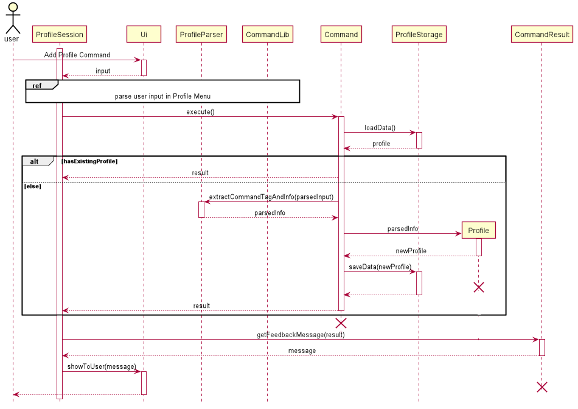
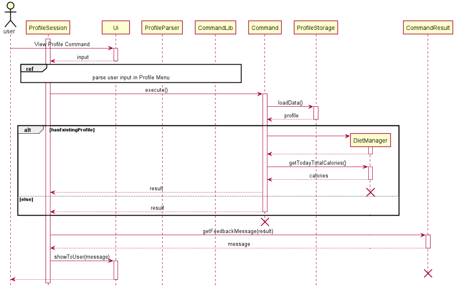
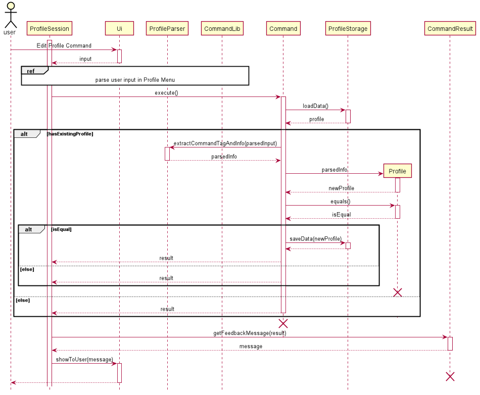
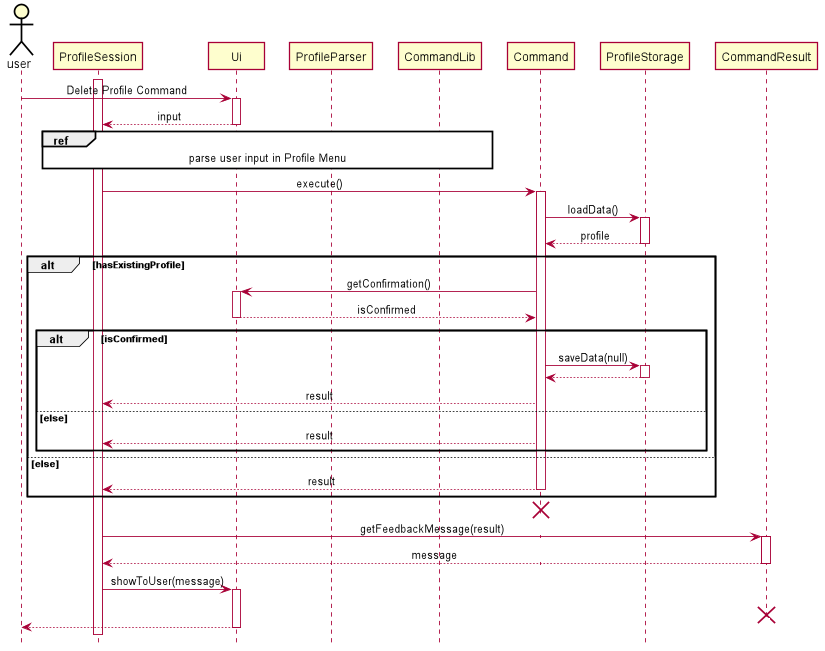

# Developer Guide
By: `CS2113T-F11-1` Since: `2020`

  


## Table of Contents
1. [**Introduction**](#intro)<br>
1.1. [Background](#background)<br>
1.2. [Purpose](#purpose)<br>
1.3. [Scope](#scope)<br>
2. [**Setting Up**](#setting-up)<br>
2.1. [Prerequisites](#prerequisites)<br>
2.2. [Setting up the Project in Your Computer](#setting-up-the-project-in-your-computer)<br>
3. [**Design**](#design)<br>
3.1. [Architecture](#architecture)<br>
3.2. [Ui Component](#ui-component)<br>
3.3. [Logic Component](#logic-component)<br>
3.4. [Model Component](#model-component)<br>
3.5. [Storage Component](#storage-component)<br>
3.6. [Common Classes](#common-classes)<br>
4. [**Implementation**](#implementation)<br>
4.1. [Main Menu-related Features](#main-menu-related-features)<br>
&nbsp;&nbsp;&nbsp;&nbsp;4.1.1. [Help Command for Main Menu](#main-help)<br>
&nbsp;&nbsp;&nbsp;&nbsp;4.1.2. [Redirecting to Profile Menu](#redirection-to-profile-menu)<br>
&nbsp;&nbsp;&nbsp;&nbsp;4.1.3. [Redirecting to Diet Menu](#redirection-to-diet-menu)<br>
&nbsp;&nbsp;&nbsp;&nbsp;4.1.4. [Redirecting to Workout Menu](#redirecting-to-workout-menu)<br>
4.2. [Profile-related Features](#profile-related-features)<br>
&nbsp;&nbsp;&nbsp;&nbsp;4.2.1. [Adding a Profile](#adding-a-profile)<br>
&nbsp;&nbsp;&nbsp;&nbsp;4.2.2. [Viewing a Profile](#viewing-a-profile)<br>
&nbsp;&nbsp;&nbsp;&nbsp;4.2.3. [Editing a Profile](#editing-a-profile)<br>
&nbsp;&nbsp;&nbsp;&nbsp;4.2.4. [Deleting a Profile](#deleting-a-profile)<br>
4.3. [Diet-related Features](#43-diet-related-features)<br>
&nbsp;&nbsp;&nbsp;&nbsp;4.3.1. [List out all commands](#431-list-out-all-commands)<br>
&nbsp;&nbsp;&nbsp;&nbsp;4.3.2. [Start recording meal data](#432-start-recording-diet-data)<br>
&nbsp;&nbsp;&nbsp;&nbsp;&nbsp;&nbsp;&nbsp;&nbsp;4.3.2.1. [Showing help message](#4321-showing-help-message)<br>
&nbsp;&nbsp;&nbsp;&nbsp;&nbsp;&nbsp;&nbsp;&nbsp;4.3.2.2. [Adding food items for the current meal](#4322-adding-food-items-for-the-current-meal)<br>
&nbsp;&nbsp;&nbsp;&nbsp;&nbsp;&nbsp;&nbsp;&nbsp;4.3.2.3. [Listing data for the current meal](#4323-listing-data-for-the-current-meal)<br>
&nbsp;&nbsp;&nbsp;&nbsp;&nbsp;&nbsp;&nbsp;&nbsp;4.3.2.4. [Deleting data from the current meal](#4324-deleting-data-from-the-current-meal)<br>
&nbsp;&nbsp;&nbsp;&nbsp;&nbsp;&nbsp;&nbsp;&nbsp;4.3.2.5. [Clearing data from the current meal](#4325-clearing-data-from-the-current-meal)<br>
&nbsp;&nbsp;&nbsp;&nbsp;&nbsp;&nbsp;&nbsp;&nbsp;4.3.2.6. [Stopping the recording of meal data](#4326-stopping-the-recording-of-meal-data)<br>
&nbsp;&nbsp;&nbsp;&nbsp;4.3.3. [List all past meal sessions](#433-list-all-past-meal-sessions)<br>
&nbsp;&nbsp;&nbsp;&nbsp;4.3.4. [Edit a past meal session](#434-edit-a-past-meal-session)<br>
&nbsp;&nbsp;&nbsp;&nbsp;4.3.5. [Delete a past meal session](#435-delete-a-past-meal-session)<br>
&nbsp;&nbsp;&nbsp;&nbsp;4.3.6. [Clear all past meal sessions](#436-clear-all-past-meal-sessions)<br>
&nbsp;&nbsp;&nbsp;&nbsp;4.3.7. [Exit the meal manager](#437-exit-the-meal-manager)<br>
4.4. [Workout-related Features](#workout-related-features)<br>
&nbsp;&nbsp;&nbsp;&nbsp;4.4.1. [Creating a New Workout Session](#creating-a-new-workout-session)<br>
&nbsp;&nbsp;&nbsp;&nbsp;&nbsp;&nbsp;&nbsp;&nbsp;4.4.1.1. [Adding an Exercise](#adding-an-exercise)<br>
&nbsp;&nbsp;&nbsp;&nbsp;&nbsp;&nbsp;&nbsp;&nbsp;4.4.1.2. [Deleting an Exercise](#deleting-an-exercise)<br>
&nbsp;&nbsp;&nbsp;&nbsp;&nbsp;&nbsp;&nbsp;&nbsp;4.4.1.3. [Listing All Exercises in This Session](#listing-all-exercises-in-this-session)<br>
&nbsp;&nbsp;&nbsp;&nbsp;&nbsp;&nbsp;&nbsp;&nbsp;4.4.1.4. [Allowing users to view help commands](#4414-Allowing-users-to-view-help-commands)<br>
&nbsp;&nbsp;&nbsp;&nbsp;&nbsp;&nbsp;&nbsp;&nbsp;4.4.1.5. [Searching for related exercises](#4415-Searching-for-related-exercises)<br>
&nbsp;&nbsp;&nbsp;&nbsp;&nbsp;&nbsp;&nbsp;&nbsp;4.4.1.6. [Ending the workout session](#4416-Ending-the-workout-session)<br>
&nbsp;&nbsp;&nbsp;&nbsp;4.4.2. [Listing past workout sessions](#442-listing-past-workout-sessions)<br>
&nbsp;&nbsp;&nbsp;&nbsp;4.4.3. [Editing workout session](#443-editing-workout-session)<br>
&nbsp;&nbsp;&nbsp;&nbsp;4.4.4. [Deleting a workout session](#444-deleting-a-workout-session)<br>
&nbsp;&nbsp;&nbsp;&nbsp;4.4.5. [Searching based on conditions](#445-searching-based-on-conditions)<br>
4.5. [Recommendations-related Features](#46-recommendations-related-features)<br> 
&nbsp;&nbsp;&nbsp;&nbsp;4.5.1. [Display expenditure](#451-display-expenditure)<br>
&nbsp;&nbsp;&nbsp;&nbsp;4.5.2. [Expenditure functionality](#452-expenditure-functionality)<br>
4.6. [Storage](#45-storage)<br>
&nbsp;&nbsp;&nbsp;&nbsp;4.6.1. [Storage for Profile](#441-select-files-to-load-from-and-save-to)<br>
&nbsp;&nbsp;&nbsp;&nbsp;4.6.2. [Storage for Diet](#442-save-current-state)<br>
&nbsp;&nbsp;&nbsp;&nbsp;4.6.3. [Storage for Workout](#443-insert-name-here)<br>
4.7. [Logging](#logging)<br>
  * [**Appendices**](#appendices)
    + [Appendix A: Product Scope](#appendix-a-product-scope)
    + [Appendix B: User Stories](#appendix-b-user-stories)
    + [Appendix C: Value proposition - Use cases](#appendix-c-value-proposition---use-cases)
    + [Appendix D: Non-Functional Requirements](#appendix-d-non-functional-requirements)
    + [Appendix E: Glossary](#appendix-e-glossary)
    + [Appendix F: Instructions for Manual Testing](#appendix-f-instructions-for-manual-testing)
    + [Appendix G: Supported Formats of Date Input](#appendix-g-supported-formats-of-date-input)

## 1. <a id="intro">Introduction</a>
### 1.1.  <a=id="background">Background</a>
The Schwarzenegger is a desktop command line interface-based app for managing all your needs regarding fitness. With the built-in personal assistant, you are able to track your daily workout and diet sessions based on your profile. If you can type fast, The Schwarzenegger can help you maximise your efficiency for maintaining fitness.
### 1.2. <a id="purpose">Purpose</a>
This document contains the specified architecture and software design specifications for the application, The Schwarzenegger. 
### 1.3. <a id="scope">Scope</a>
This document describes the software architecture and software design requirements for The Schwarzenegger. This guide is mainly for developers, designers and software engineers that are or going to work on The Schwarzenegger. 

[&#8593; Return to Top](#developer-guide)

## 2. <a id="setting-up">Setting Up</a>

### 2.1. <a id="prerequisites">Prerequisites</a>
1. JDK `11`.
2. IntelliJ IDEA IDE.

### 2.2. <a id="setting-up-the-project-in-your-computer">Setting up the Project in Your Computer</a>
1. Fork [this repository](https://github.com/AY2021S1-CS2113T-F11-1/tp), and clone the fork to your computer.
2. Open IntelliJ (if you are not in the welcome screen, click `File` > `Close Project` to close the existing project dialog first).
3. Set up the correct JDK version for Gradle  
   1. Click `Configure` > `Structure for New Projects` and then `Project Settings` > `Project` > `Project SDK`.
   2. If `JDK 11` is listed in the drop down, select it. Otherwise, click `New…` and select the directory where you installed `JDK 11`.
   3. Click `OK`.
4. Click `Import Project`.
5. Locate the `build.gradle` file and select it. Click `OK`.
6. Click `Open as Project`.
7. Click `OK` to accept the default settings if prompted. 

[&#8593; Return to Top](#developer-guide)

## 3. <a id="design">Design</a>
This section provides a high level overview of our application, The Schwarzenegger.
### 3.1. <a id="architect">Architecture</a>

![Architecture]

The image above explains the design of the application, The Schwarzenegger. 

The main driver of the application is `Main: Duke`. It is responsible for mainly two phases:
- At application launch
    - This class will initialise the components in the correct sequence and is in charge of connecting them with each other.
- At shut down
    - This class will invoke cleanup method for the components when necessary.
    
In addition to that, the architecture of The Schwarzenegger is broken down into several packages, mainly the following: 
- `Ui`: This class mainly handles the interactions with user of the application.
- `Parser`: This class mainly handles the parsing and handling of user commands.
- `Command`: This class handles the type of command.
- `Profile`: This class manages the data of the user.
- `Diet`: This class manages the meal recording sessions.
- `Workout`: This class manages the data workout recording sessions.
- `Storage`: This class reads data from and writes data back into a text file for future uses.

[&#8593; Return to Top](#developer-guide)

### 3.2. <a id="ui-component">Ui Component</a>


API: `Ui.java`
 
The `Ui` package is a combination class where all interaction will be made through this component
 
The `Ui` component,

* Takes in user input
* Prints out response messages

[&#8593; Return to Top](#developer-guide)

### 3.3. <a id="logic-component">Logic Component</a>


1. `The Schwarzenegger` uses `Parser` classes to parse the user command.
2. This splits the user input into interpretable portions by other functions.

[&#8593; Return to Top](#developer-guide)

### 3.4. <a id="model-component">Model Component</a>


The Model component contains `Profile`, `DietManager`,
`PastRecord` and `WorkoutSession` classes.
* Profile: Stores the user profile data.
* DietManager: Stores all past diet records.
* PastRecord: Stores meta information of each WorkoutSession files.
* WorkoutSession: Stores the exercise data done in each workout session.

[&#8593; Return to Top](#developer-guide)

### 3.5. <a id="storage-component">Storage Component</a>


Profiles, Diet sessions and workout sessions are stored in separate folders. 

The Storage package contains subpackages for profile, diet manager and workout manager.

The readDietSession() method in storage.diet package is used for loading saved diet sessions, which are loaded when the user wants to edit a past meal session.
readPastRecords() and readFileContents() methods in storage.workout package are used for loading saved workout managers and workout sessions respectively. It is called when the user accesses the workout manager.
loadData() from storage.profile is used to load user profile data and is called when the program starts up. 

The writeToStorageDietSession() method in storage.diet package saves the meal session and is called when the user exits it.
writePastRecords() and writeToStorage() methods in storage.workout package are used to save the workout managers and workout sessions respectively. It is called when the user exists the workout manager.
saveData() method in storage.profile is called when the user creates the user profile or edits it.

[&#8593; Return to Top](#developer-guide)

### 3.6. <a id="common-classes">Common Classes</a> 
Classes used by multiple components are in the `seedu.duke` and the `ui` package, specifically Constant.java and CommonUi.java.

[&#8593; Return to Top](#developer-guide)

## 4. <a id="implementation">Implementation</a>
This section describes some details on how the features are being implemented. All profile/ diet/ workout-related features.


All profile/ diet/ workout-related features can be broken down into 4 distinct functionality, addition, viewing/ listing, deletion and editing.
For diet and workout-related features, there is an additional functionality of searching.

### 4.1. <a id="main-menu-related-features">Main Menu-related Features</a>

#### 4.1.1. <a id="main-help">Help Command for Main Menu</a>

The `help` command allows users to view all the available commands in the main page. The command for showing help message is `help`.

#### 4.1.2. <a id="redirecting-to-profile-menu">Redirecting to Profile Menu</a>

The redirection to profile page allows the user to enter Profile Menu to create, edit, view and delete user profile. The command for this redirection is `profile`.

#### 4.1.3. <a id="redirecting-to-diet-menu">Redirecting to Diet Menu</a>

The redirection to profile page allows the user to enter Diet Menu to create, edit, list and delete diet sessions. The command for this redirection is `diet`.

#### 4.1.4. <a id="redirecting-to-workout-menu">Redirecting to Workout Menu</a>

The redirection to profile page allows the user to enter Workout Menu to create, edit, list and delete workout sessions. The command for this redirection is `workout`.

### 4.2. <a id="profile-related-features">Profile-related Features</a>
#### 4.2.1. <a id="adding-a-profile">Adding a Profile</a>

This feature allows user to add a new profile. The failure to do so will trigger an exception where the user will be notified of the reason, e.g. invalid command format. The action will be aborted, and the program will advise the user to type "help" for command syntax reference. 

If the creation is successful, a confirmation message on the newly created profile will be displayed to the user. 

**Implementation**

When the user attempts to add a new profile, the ProfileSession, Ui, ProfileParser, Command, CommandLib, ProfileStorage, Profile and CommandResult classes will be accessed, and the following sequence of actions is called to prompt execution result to user:

1. User executes `add /n Schwarzenegger /h 188 /w 113 /e 100 /c 2500`
    1. `ProfileSession` calls `Ui.getCommand()` to receive user input.
    1. `ProfileSession` calls `ProfileParser.parseCommand()` to parse user input into a string array.
1. Creating `ProfileAdd` object.
    1. Based on the parsed input, `ProfileSession` calls `CommandLib` to return the correct Command Object `ProfileAdd`.
1. Executing command.
    1. `ProfileSession` calls `ProfileAdd.execute()` with the rest of parsed input.
    1. `ProfileAdd` calls `ProfileStorage.loadData()` to load existing profile in the system. If there is an existing profile, `ProfileAdd` returns a failure result to `ProfileSession`. Otherwise, the process continues with step `iii`.
    1. `ProfileAdd` calls `ProfileParser.extractCommandTagAndInfo()` to parse user input into specific tags and information. 
    1. Based on the parsed information from `ProfileParser.extractCommandTagAndInfo()`, `ProfileAdd` creates a new `Profile`.
    1. `ProfileAdd` calls `ProfileStorage.saveData()` to save the `Profile` object.
    1. `ProfileAdd` returns a successful result to `ProfileSession`.
1. Prompting result to user.
    1. `ProfileSession` calls `CommandResult.getFeedbackMessage()` to get the execution feedback message.
    1. `ProfileSession` calls `Ui.showToUser()` to show result to the user.

All descriptions, warnings and responses will be handled by `Ui` to ensure consistence across the app.

The sequence diagram below summarizes how creating a new profile works:



**Design considerations**

Parsing of the user’s input command:

- Alternative 1 (current choice): User’s command is split into size 2 array first containing command type and command arguments. Then arguments are split into command tag and information pairs.  

|     |     |
|-----|-----|
|**Pros** | Command tags do not have to follow a fixed order.|
|**Cons** | It takes multiple steps in parsing the command.|

- Alternative 2: User’s command is divided by space
                 
|     |     |
|-----|-----|
|**Pros** | The parsing can be easily done by calling Java built-in function .split(). Supports multiple tags or no tags.|
|**Cons** | Values for each variable cannot contain spaces which makes the application restrictive, especially for user's name.|

[&#8593; Return to Top](#developer-guide)

#### 4.2.2. <a id="viewing-a-profile">Viewing a Profile</a>
This feature allows user to view added profile with calculated BMI based on height and weight. The failure to do so will trigger an exception where the user will be notified of the reason, e.g. redundant parameters. The action will be aborted, and the program will advise the user to type "help" for command syntax reference. 

If the data loading is successful, a message on the added profile will be displayed to the user. 

**Implementation**

When the user attempts to view an added profile, the ProfileSession, Ui, ProfileParser, Command, CommandLib, ProfileStorage, Profile and CommandResult classes will be accessed. The following sequence of steps will then occur:

1. User executes `view`
    1. `ProfileSession` calls `Ui.getUserCommand()` to receive user input.
    1. ProfileSession` calls `ProfileParser.parseCommand()` to parse user input into a string array.
1. Creating `ProfileView` object.
    1. Based on the parsed input, `ProfileSession` calls `CommandLib` to return the correct Command Object `ProfileView`.
1. Executing command.
    1. `ProfileSession` calls `ProfileView.execute()` with the rest of parsed input.
    1. `ProfileView` calls `ProfileStorage.loadData()` to load existing profile in the system. If there is no existing profile, `ProfileView` returns a failure result to `ProfileSession`. Otherwise, the process continues with step `iii`.
    1. `ProfileView` calls `Profile.toString()` to get string representation of `Profile`.
    1. `ProfileView` returns a result to `ProfileSession`.    
1. Prompting result to user.
    1. `ProfileSession` calls `CommandResult.getCommandResult()` to get the `CommandResult` object.
    1. `ProfileSession` calls `Ui.showToUser()` to show result to the user.

All descriptions, warnings and responses will be handled by `Ui` to ensure consistence across the app.

The sequence diagram below summarizes how viewing an added profile works:



**Design considerations**

Aspects: Loading of stored data

- Alternative 1 (current choice): call public methods of Storage class to 
load the profile from hard disk every time the user wants to view profile.

|     |     |
|-----|-----|
|**Pros** | Profile data is up-to-date if the user prefers to edit it in text file rather than using commands in The Schwarzenegger.|  
|**Cons** | Execution time is slow down due to multiple times of loading the data.|

- Alternative 2: call public methods of Storage class to load the profile from hard disk only when user enters Profile Menu.

|     |     |
|-----|-----|
|**Pros** | Execution time is fast.|  
|**Cons** | Profile data is not updated in real time if user edits it in text editor while running The Schwarzenegger.|

[&#8593; Return to Top](#developer-guide)

#### 4.2.3. <a id="editing-a-profile">Editing a Profile</a>
This feature allows user to anytime go back to edit a profile created in the past such as editing physique data and expected daily calories intake. The failure to do so will trigger an exception where the user will be notified of the reason, e.g. invalid command format. The action will be aborted, and the program will advise the user to type "help" for command syntax reference. 

If the editing is successful, a confirmation message on the edited profile will be displayed to the user. 

**Implementation**

When the user attempts to edit a profile, the ProfileSession, Ui, ProfileParser, Command, CommandLib, ProfileStorage, Profile and CommandResult classes will be accessed, and the following sequence of actions is called to prompt execution result to user:

1. User executes `edit /w 60`
    1. `ProfileSession` calls `Ui.getCommand()` to receive user input.
    1. `ProfileSession` calls `ProfileParser.parseCommand()` to parse user input into a string array.
1. Creating `ProfileEdit` object.
    1. Based on the parsed input, `ProfileSession` calls `CommandLib` to return the correct Command Object `ProfileEdit`.
1. Executing command.
    1. `ProfileSession` calls `ProfileEdit.execute()` with the rest of parsed input.
    1. `ProfileEdit` calls `ProfileStorage.loadData()` to load existing profile in the system. If there is no existing profile, `ProfileAdd` returns a failure result to `ProfileSession`. Otherwise, the process continues with step `iii`.
    1. `ProfileEdit` calls `ProfileParser.extractCommandTagAndInfo()` to parse user input into specific tags and information.
    1. Based on the parsed information from `ProfileParser.extractCommandTagAndInfo()`, `ProfileEdit` creates a new `Profile`.
    1. `ProfileEdit` calls `Profile.equals()` to compare the edited and existing profile. If there are no changes, `ProfileEdit` returns a failure result to `ProfileSession`. Otherwise, the process continues with step `vi`.
    1. `ProfileEdit` calls `ProfileStorage.saveData()` to save the edited `Profile` object.
    1. `ProfileAdd` returns a successful result to `ProfileSession`.
1. Prompting result to user.
    1. `ProfileSession` calls `CommandResult.getFeedbackMessage()` to get the execution feedback message.
    1. `ProfileSession` calls `Ui.showToUser()` to show result to the user.

All descriptions, warnings and responses will be handled by `Ui` to ensure consistence across the app.

The sequence diagram below summarizes how creating a new profile works:



**Design considerations**

Parsing of the user’s input command:

- Alternative 1 (current choice): User’s command is split into size 2 array first containing command type and command arguments. Then arguments are split into command tag and information pairs.  

|     |     |
|-----|-----|
|**Pros** | Command tags do not have to follow a fixed order.|
|**Cons** | It takes multiple steps in parsing the command.|

- Alternative 2: User’s command is divided by space
                 
|     |     |
|-----|-----|
|**Pros** | The parsing can be easily done by calling Java built-in function .split(). Supports multiple tags or no tags.|
|**Cons** | Values for each variable cannot contain spaces which makes the application restrictive.|

[&#8593; Return to Top](#developer-guide)

#### 4.2.4. <a id="deleting-a-profile">Deleting a Profile</a>

This feature allows user to delete a profile created in the past. The failure to do so will trigger an exception where the user will be notified of the reason, e.g. redundant parameters. The action will be aborted, and the program will advise the user to type "help" for command syntax reference. 

If the deletion is successful, a confirmation message on the profile deletion will be displayed to the user. 

**Implementation**

When the user attempts to delete an added profile, the ProfileSession, Ui, ProfileParser, Command, CommandLib, ProfileStorage, Profile and CommandResult classes will be accessed. The following sequence of steps will then occur:

1. User executes `delete`
    1. `ProfileSession` calls `Ui.getUserCommand()` to receive user input.
    1. ProfileSession` calls `ProfileParser.parseCommand()` to parse user input into a string array.
1. Creating `ProfileDelete` object.
   1. Based on the parsed input, `ProfileSession` calls `CommandLib` to return the correct Command Object `ProfileDelete`.
1. Executing command.
    1. `ProfileSession` calls `ProfileDelete.execute()` with the rest of parsed input.
    1. `ProfileDelete` calls `ProfileStorage.loadData()` to load existing profile in the system. If there is no existing profile, `ProfileDelete` returns a failure result to `ProfileSession`. Otherwise, the process continues with step `iii`.
    1. `ProfileDelete` calls `Ui.CheckConfirmation()` to get user's confirmation on the deletion since this action is irrevocable. If user  fails to confirm, `ProfileDelete` returns an abort result to `ProfileSession`. Otherwise, the process continues with step `iv`.
    1. `ProfileDelete` calls `ProfileStorage.saveData()` to save a `null` object which represents a deleted profile.
    1. `ProfileDelete` returns a result to `ProfileSession`.   
1. Prompting result to user.
    1. `ProfileSession` calls `CommandResult.getFeedbackMessage()` to get the execution feedback message.
    1. `ProfileSession` calls `Ui.showToUser()` to show result to the user.

All descriptions, warnings and responses will be handled by `Ui` to ensure consistence across the app.

The sequence diagram below summarizes how deleting an added profile works:



**Design considerations**

Aspects: Loading of stored data

- Alternative 1 (current choice): call public methods of Storage class to load the profile from hard disk every time the user wants to delete profile.

|     |     |
|-----|-----|
|**Pros** | Profile data is up-to-date if the user prefers to edit it in text file rather than using commands in The Schwarzenegger.|  
|**Cons** | Execution time is slow down due to loading the data.|

- Alternative 2: call public methods of Storage class to load the profile from hard disk when user enter Profile Menu.

|     |     |
|-----|-----|
|**Pros** | Execution time is fast.|  
|**Cons** | Profile data is not updated in real time if user edits it in text file while running The Schwarzenegger.|

### 4.3. Diet-related Features
#### 4.3.1. Listing out all commands: `help`
The command to list out all help commands is a hard-typed list of commands that indicates to the user all the commands available and how to use them.

**Implementation**  
When the user types `help` the following sequence occurs. 
1. The user keys in `help`.
    
    1. A `DietSessionUi` component will call `dietSessionUI.getInput()`. 
    1. Input will be parsed in `processCommand()`.   
    
2. Creation of command object from input
    1. This will create a DietSessionHelp() instantiation of which the method execute() is called.
    
3. Executing Command
    1. The newly created object will call print out the list of commands onto the console with printHelpFormatter() from static CommonUi.java.
[&#8593; Return to Top](#developer-guide)

#### 4.3.2. Start recording meal data: `meal`
The feature allows users to start recording meal data. 

**Implementation**  
When the user types `meal /d [date] /t [type]` the following sequence occurs. 
1. The user keys in `meal /d 2020-05-04 /t breakfast`.
    
    1. A `DietSessionUi` component will call `dietSessionUI.getInput()`. 
    1. Input will be parsed in `processCommand()`.   
    
2. Creation of command object from input
    1. This will create a DietSessionCreate() of which the method execute() is called.
    
3. Executing Command
    1. The newly created object will then create an instantiation of a DietSession.

The sequence diagram below summarizes how creating new diet session works:


[&#8593; Return to Top](#developer-guide)

#### 4.3.2.1. Showing help message: `help`
The command to list out all help commands is a hard-typed list of commands that indicates to the user all the commands available and how to use them.

**Implementation**  
When the user types `help` the following sequence occurs. 
1. The user keys in `help`.
    
    1. A `DietSessionUi` instantiation calls `dietSessionUI.getInput()`. 
    1. Input will be parsed in `processCommand()`.   
    
2. Creation of command object from input
    1. This will create a FoodItemHelp() instantiation of which the method execute() is called.
    
3. Executing Command
    1. The newly created object will call print out the list of commands onto the console with printHelpFormatter() from static CommonUi.java.
    
[&#8593; Return to Top](#developer-guide)

#### 4.3.2.2. Adding food items for the current meal: `add`

The feature allows users to add food items into the current meal session. 

**Implementation**  
When the user types `add [food] /c [calories]` the following sequence occurs. 
1. The user keys in `add bologna /c 123`.
    
    1. A `DietSessionUi` component will call `dietSessionUI.getInput()`. 
    1. Input will be parsed in `processCommand()`.   
    
2. Creation of command object from input
    1. This will create a FoodItemAdd() instantiation of which the method execute() is called.
    1. The food component and calories component are passed into the constructor of a Food instantiation.
    
3. Executing Command
    1. The newly created food object will then be added to an ArrayList<Food>.

[&#8593; Return to Top](#developer-guide)

#### 4.3.2.3. Listing data for the current meal: `list`

The feature allows users to view all food items in the current meal session. 

**Implementation**  
When the user types `list` the following sequence occurs. 
1. The user keys in `list`.
    
    1. A `DietSessionUi` component will call `dietSessionUI.getInput()`. 
    1. Input will be parsed in `processCommand()`.   
    
2. Creation of command object from input
    1. This will create a FoodItemList() instantiation of which the method execute() is called.
    
3. Executing Command
    1. A for loop iterates through the entire ArrayList<Food> and prints out every item with their calories.

#### 4.3.2.4. Deleting data from the current meal: `delete`

The feature allows users to remove food items into the current meal session. 

**Implementation**  
When the user types `delete [Food ID]` the following sequence occurs. 
1. The user keys in `delete 1`.
    
    1. A `DietSessionUi` component will call `dietSessionUI.getInput()`. 
    1. Input will be parsed in `processCommand()`.   
    
2. Creation of command object from input
    1. This will create a FoodItemDelete() instantiation of which the method execute() is called.
    
3. Executing Command
    1. The Food ID according to the index based on the ArrayList<Food> is deleted.

#### 4.3.2.5. Clearing all data from the current meal `clear`

The feature allows users to remove food items into the current meal session. 

**Implementation**  
When the user types `clear` the following sequence occurs. 
1. The user keys in `clear`.
    
    1. A `DietSessionUi` component will call `dietSessionUI.getInput()`. 
    1. Input will be parsed in `processCommand()`.   
    
2. Creation of command object from input
    1. This will create a FoodItemClear() instantiation of which the method execute() is called.
    
3. Executing Command
    1. The ArrayList Clear method is called and removes all Food entries from the ArrayList.

#### 4.3.2.6. Stopping the recording of meal data: `end`

The feature allows users to end the current meal session and return back to the meal manager.

**Implementation**  
When the user types `end` the following sequence occurs. 
1. The user keys in `end`.
    
    1. A `DietSessionUi` component will call `dietSessionUI.getInput()`. 
    1. Input will be parsed in `processCommand()`.   
    
2. Exiting of inputLoop()
    The inputLoop() exits when userInput.equals("end").

#### 4.3.3. List all past diet sessions: `list`

The feature allows users to view all past created diet sessions.

**Implementation**  
When the user types `list` the following sequence occurs. 
1. The user keys in `list`.
    
    1. A `DietSessionUi` component will call `dietSessionUI.getInput()`. 
    1. Input will be parsed in `processCommand()`.   
    
2. Creation of command object from input
    1. This will create a FoodItemList() instantiation of which the method execute() is called.
    
3. Executing Command
    1. A for loop iterates through the entire ArrayList<Food> and prints out every item with their calories.

#### 4.3.4. Edit a past diet session: `edit`

The feature allows users to edit previously created diet sessions.

**Implementation**  
When the user types `edit [diet session ID]` the following sequence occurs. 
1. The user keys in `edit 1`.
    
    1. A `DietSessionUi` component will call `dietSessionUI.getInput()`. 
    1. Input will be parsed in `processCommand()`.   
    
2. Creation of command object from input
    1. A DietSessionEdit() command class instantiation is created and the execute() method is called.
    
3. Executing Command
    1. This will call readDietSession() from storage.diet.Storage and it reads the file stored at saves/diet.
    1. A for loop iterates through the entire ArrayList<Food> and prints out every item with their calories.

The sequence diagram below summarizes how editing Diet session works:


#### 4.3.5. Edit a past diet session: `delete`

The feature allows users to delete previously created diet sessions.

**Implementation**  
When the user types `delete [diet session ID]` the following sequence occurs. 
1. The user keys in `delete 1`.
    
    1. A `DietSessionUi` component will call `dietSessionUI.getInput()`. 
    1. Input will be parsed in `processCommand()`.   
    
2. Creation of command object from input
    1. A DietSessionDelete() command class instantiation is created and the execute() method is called.
    
3. Executing Command
    1. This will delete the diet session at index 1 based on the `list` command.

#### 4.3.6. Edit a past diet session: `clear`

The feature allows users to clear all previously created diet sessions.

**Implementation**  
When the user types `clear` the following sequence occurs. 
1. The user keys in `clear`.
    
    1. A `DietSessionUi` component will call `dietSessionUI.getInput()`. 
    1. Input will be parsed in `processCommand()`.   
    
2. Creation of command object from input
    1. A DietSessionClear() command class instantiation is created and the execute() method is called.
    
3. Executing Command
    1. This will iterate through every file in saves/diet/ and delete it.

#### 4.3.7. Edit a past diet session: `end`

The function returns user back to the main menu of The Schwarzenegger.

**Implementation**  
When the user types `end` the following sequence occurs. 
1. The user keys in `end`.
    
    1. A `DietSessionUi` component will call `dietSessionUI.getInput()`. 
    1. Input will be parsed in `processCommand()`.   
    
2. Exiting of inputLoop()
    The inputLoop() exits when userInput.equals("end").


[&#8593; Return to Top](#developer-guide)


### 4.4. <a id="workout-related-features">Workout-related Features</a>
#### 4.4.1. <a id="creating-a-new-workout-session">Creating a New Workout Session</a>

Users can create a new workout session. The failure to do so will trigger an exception where the user will be notified 
of the reason, e.g. invalid command or IO related errors. The action will be aborted. If the creation is successful, 
the user will go into the new workout session to edit the exercises in that session.

The user can specify tags for the session. Creation time, last edit time and saving file name will be auto generated 
by the application and saved. 

**Implementation**

When the user attempts to create a new workout session, the Ui, WorkoutManagerParser 
and CommandLib class will be accessed and the following sequence of 
actions are called to return a command object NewWs.

1. User executes `new /t leg chest`
     1. `WorkoutManager` calls `Ui.getUserCommand()` to receive user input.
     2. `WorkoutManager` calls `WorkoutManagerParser.parse` into a string array
1. Creation of command object.
     1. Based on the parsed input, `WorkoutManager` calls `CommandLib` to return the correct Command Object `NewWs`.
1. Executing Command
    1. `WorkoutManager` calls `NewWS.execute()` with the rest of parsed input.
    1. `NewWS` parse the arguments to identify the tags
    3. `NewWS` calls `PastRecordList.add()` to create a new file to store information in this session. 
    If the creation fails, the action is aborted. Else, this record will be stored and the file path will 
    be returned.
    4. `NewWS` creates a new `WorkoutSession` Object with the file path. 
    5.  `NewWS` calls `workoutSession. workoutSessionStart()` so that user can add information into this session.
    6. After user exits this workout, `WorkoutManager` returns a `CommandResult`.
1. Based on `CommandResult`, correct response will be be printed to user.

All description, warnings and response will be handled by `Ui` to ensure consistence across the app.
The following sequence diagram shows how the new command works

The sequence diagram below summarizes how creating new workout session works:

**Design considerations**
Parsing of the user’s input command:  

- Alternative 1 (current choice): User’s command are divided by space

|     |     |
|-----|-----|
|**Pros** | The parsing can be easily done by calling Java built-in function .split(). Supports multiple tags or no tags.|
|**Cons** | Values for each variable cannot contain spaces which makes the application restrictive.|

- Alternative 2: Multiple prompts for user’s input of a workout data

|     |     |
|-----|-----|
|**Pros** | Users would not have to make sure that their command is syntactically right.|  
|**Cons** | The constant prompting could subject the application to a negative experience in the difficulty to use the commands.|

[&#8593; Return to Top](#developer-guide)
#### 4.4.1.1. <a id="adding-an-exercise">Adding an Exercise</a>

Users can add a new exercise. The failure to do so will trigger an exception where the user will be notified of 
the reason, e.g. invalid command or IO related errors. The action will be aborted. If the addition is successful, 
a new exercise will be added to the exerciselist.

**Implementation**

When the user attempts to create a new workout session, the Ui, WorkoutManagerParser 
and CommandLib class will be accessed and the following sequence of 
actions are called to return a command object NewWs.

1. User executes `add benchpress /n 6 /w 120`
     1. `WorkoutSession` calls `Ui.getUserCommand()` to receive user input.
     2. `WorkoutSession` calls `WorkoutSessionParser.workoutSessionParser` to convert the input to a string array.
1. Creation of command object.
     1. Based on the parsed input, `WorkoutManager` calls `CommandLib` to return the correct Command Object `WorkoutSessionAdd`.
1. Executing Command
    1. `WorkoutManager` calls `WorkoutSessionAdd.execute()` with the rest of parsed input.
    2. `WorkoutSessionAdd` parse the arguments to identify the repetitions and weight for the exercise.
    3. `WorkoutSessionAdd` calls `WorkOutSession.Storage.writeToFile()` to store information of all exercises recorded. 
1. Based on `ExecutionResult`, correct response will be be printed to user.

All description, warnings and response will be handled by `ui` to ensure consistence across the app.
The following sequence diagram shows how the add command works

The sequence diagram below summarizes how creating new workout session works:


[&#8593; Return to Top](#developer-guide)
#### 4.4.1.2. <a id="deleting-an-exercise">Deleting an Exercise</a>

Users can delete an exercise from a pre-existing list of exercise. The failure to do so will trigger an exception where the user will be notified of 
the reason, e.g. invalid command or IO related errors. The action will be aborted. If the addition is successful, 
a new exercise will be added to the exerciselist.

**Implementation**

When the user attempts to create a new workout session, the Ui, WorkoutManagerParser 
and CommandLib class will be accessed and the following sequence of 
actions are called to return a command object NewWs.

1. User executes `add benchpress /n 6 /w 120`
     1. `WorkoutSession` calls `Ui.getUserCommand()` to receive user input.
     2. `WorkoutSession` calls `WorkoutSessionParser.workoutSessionParser` to convert the input to a string array.
1. Creation of command object.
     1. Based on the parsed input, `WorkoutManager` calls `CommandLib` to return the correct Command Object `WorkoutSessionAdd`.
1. Executing Command
    1. `WorkoutManager` calls `WorkoutSessionAdd.execute()` with the rest of parsed input.
    2. `WorkoutSessionAdd` parse the arguments to identify the repetitions and weight for the exercise.
    3. `WorkoutSessionAdd` calls `WorkOutSession.Storage.writeToFile()` to store information of all exercises recorded. 
1. Based on `ExecutionResult`, correct response will be be printed to user.

All description, warnings and response will be handled by `ui` to ensure consistence across the app.
The following sequence diagram shows how the add command works

The sequence diagram below summarizes how creating new workout session works:


[&#8593; Return to Top](#developer-guide)
#### 4.4.1.3. <a id="listing-all-exercises-in-this-session">Listing All Exercises in This Session</a>


[&#8593; Return to Top](#developer-guide)
#### 4.4.1.4. Allowing users to view help commands


[&#8593; Return to Top](#developer-guide)
#### 4.4.1.5. Searching for related exercises


[&#8593; Return to Top](#developer-guide)
#### 4.4.1.6. Ending the workout session


[&#8593; Return to Top](#developer-guide)
#### 4.4.2. Listing past workout sessions
The feature to list workoutSessions allows the user to view a summary of all the history 
workout sessions, including their index, creation date and tags.

**Implementation**
When the user attempts to list workoutSessions, the WorkoutManger, WorkoutManagerParse, ListWS and 
WorkoutManagerStorage class will be called upon. The following sequence of steps will then occur:

1. User executes `list`
     1. `WorkoutManager` calls `Ui.getUserCommand()` to receive user input.
     2. `WorkoutManager` calls `WorkoutManagerParser.parse` into a string array
1. Creation of command object.
     1. Based on the parsed input, `WorkoutManager` calls `CommandLib` to return the correct Command Object `ListWS`.
1. Executing Command
    1. `WorkoutManager` calls `ListWS.execute()` to execute the command
    3. `ListWS` calls `PastRecordList.list()`
    1. `PastRecordList` will return formatted list.
    6. `WorkoutManager` returns a `CommandResult` which contains the formated list and execution result.
1. Based on `ExecutionResult`, correct response will be be printed to user.
**Design considerations**
Aspects: Security of stored data

- Alternative 1 (current choice): call public methods of Storage class to 
print the list

|     |     |
|-----|-----|
|**Pros** | pastRecord are private and it can only be manipulated through designed public methods. Only selected data will be printed and viewed.|  
|**Cons** | Most methods Storage needs to be a static.|

- Alternative 2: Storage return a readonly list of pastRecord.

|     |     |
|-----|-----|
|**Pros** | More versatile operations can be done.|  
|**Cons** | All data of pastRecord will be exposed.|


[&#8593; Return to Top](#developer-guide)
#### 4.4.3. Editing workout session
User can anytime go back to edit a workout session created in the past such as
adding or removing exercies in that session.

Each past workout session is stored in a different file name following its creation time.
The meta information of these past records such as file name, creation time are
stored in another file which will be loaded as the program initlises.
The actual workout session record will only be loaded if needed e.g. when editting is called. 

**Implementation**
When the user attempts to edit a past workout session, the Ui, WorkoutManagerParser, CommandLib
and WorkoutStorage class will be accessed and the following sequence of 
actions are called.

1. User executes `edit 1`
     1. `WorkoutManager` calls `Ui.getUserCommand()` to receive user input.
     2. `WorkoutManager` calls `WorkoutManagerParser.parse` into a string array
1. Creation of command object.
     1. Based on the parsed input, `WorkoutManager` calls `CommandLib` to return the correct Command Object `EditWS`.
1. Executing Command
    1. `WorkoutManager` calls `EditWS.execute()` with the rest of parsed input.
    3. `EditWS` calls `PastRecordList.edit()` to locate the file. If the does not exist, the action is aborted. Else, `PastRecordList` updates the meta information of the file. The file path will be returned.
    4. `EditWS` creates a new `WorkoutSession` Object with the file path. `WorkoutSession` is initilised by loading the data in the file.
    5.  `EditWS` calls `workoutSession.workoutSessionStart()` so that user start editing this session.
    6. After user exits this workout, `WorkoutManager` returns a `CommandResult`.
1. Based on `CommandResult`, correct response will be printed to user.

All description, warnings and response will be handled by `Ui` to ensure consistence across the app.
The following sequence diagram shows how the new command works

The sequence diagram below summarizes how editting past record works:

**Design considerations**
Past record storage and model design:  

- Alternative 1 (current choice): store past workout sessions in different files and their 
meta information in a separate file

|     |     |
|-----|-----|
|**Pros** | Initialization will be faster as data loaded grows little even in long terms.|
|**Cons** | Deleting files and creating files need to handle file names carefully.|

- Alternative 2: Load all past records during initilization.

|     |     |
|-----|-----|
|**Pros** | Run time can retrieve data faster as there is no need to access data in hard disk.|  
|**Cons** | The application initialization will grow quickly as the application scales.|

[&#8593; Return to Top](#developer-guide)
#### 4.4.4. Deleting a workout session
User can delete a workout session created in the past by giving its index.

Each past workout session is stored in a different file name following its creation time.
The meta information of these past records such as file name, creation time are
stored in another file which will be loaded as the program initlises.
When the user tries to delete a file, the application refers to the meta information of the file to locate the
file and delete it. Then the meta information of the record will be deleted.

User can clear all data by iteratively delete the record until the meta data file is empty. To simplify that,
user can use `clear` command to achieve that.

**Implementation**

When the user attempts to delete a past workout session, the Ui, WorkoutManagerParser, CommandLib
and WorkoutStorage class will be accessed and the following sequence of actions are called.

1. User executes `delete 1` or `clear`
     1. `WorkoutManager` calls `Ui.getUserCommand()` to receive user input.
     2. `WorkoutManager` calls `WorkoutManagerParser.parse` into a string array
1. Creation of command object.
     1. Based on the parsed input, `WorkoutManager` calls `CommandLib` to return the correct Command Object `DeleteWS`
     or `clearWS`.
1. Executing Command
    1. `WorkoutManager` calls `DeleteWS.execute()` with the rest of parsed input.
    3. `DeleteWS` calls `PastRecorList.delete()` to locate the file. If the does not exist, the action is aborted. Else, `PastRecorList` remove the meta information of the file and delete the record file.
    6. After user exits this workout, `WorkoutManager` returns a `CommandResult`.
1. Based on `CommandResult`, correct response will be printed to user.

All description, warnings and response will be handled by `Ui` to ensure consistence across the app.

**Design considerations**

- Alternative 1 (current choice): Delete `workoutSession` by specifying index of it.

|     |     |
|-----|-----|
|**Pros** | Quick and easy deletion by using ArrayList.get().|
|**Cons** | DLesser alternatives for the user and user would have to identify the index first by executing `list` to get index of the session to be deleted.|

- Alternative 2: Delete `workoutSession` by specifying `workoutSession` tags or dates.

|     |     |
|-----|-----|
|**Pros** | More alteratives for users. Can bulk delete files with certain attributes|  
|**Cons** | Tags and dates does not uniquely identify the record hence may result in accidental wrong deletion|
#### 4.4.5. Searching based on conditions
The feature `search` allows the user to view a summary of all the history 
workout sessions which satisfies certain conditions.

The user can search by the date of creation or the tags that the session has. User can put in 0
or 1 or 2 criteria during search. 

**Implementation**
Format: `search /t <tag1> <tag2> /d <date>`

The user can attach variable number of tags after `/t` and one date after `/d`. The date must be specified
in certain formats for it to be recognisable. Else, it will be treated as there is no date criteria given.
[See here](#appendix-g-supported-formats-of-date-input) for all supported formats.

The tag criterion selects sessions which contains all the tags that the user specified in the search.
The date criterion selects the sessions which is created on that date. Only sessoins that satisfies all condtions 
will be selected and displayed.

The result is displayed in a table with the index of the selected records so that users can easily 
do further operations on them, e.g. `delete` or `edit`.
 
When the user attempts to list workoutSessions, the WorkoutManger, DeleteWS, WorkoutManagerStorage and 
WorkoutManagerParse class will be called upon. The following sequence of steps will then occur:

1. User executes `search /t leg /d 20201017`
     1. `WorkoutManager` calls `Ui.getUserCommand()` to receive user input.
     2. `WorkoutManager` calls `WorkoutManagerParser.parse` into a string array
1. Creation of command object.
     1. Based on the parsed input, `WorkoutManager` calls `CommandLib` to return the correct Command Object `SearchWS`.
1. Executing Command
    1. `WorkoutManager` calls `SearchWS.execute()` to execute the command
    3. `SearchWS` calls `WorkOutManagerStorage.search()`
    1. `WorkOutManagerStorage` will call `WorkoutManagerParser.parse` to parse the arguments into
    an array of predicates
    1. `WorkOutManagerStorage` filters the pastRecord arraylist and print out the ones
    which satisfy the predication.
    6. `WorkoutManager` returns a `ExecutionResult`.
1. Based on `ExecutionResult`, correct response will be be printed to user.

The sequence diagram below summarizes how searching record works:

**Design considerations**
Aspects: indexing the selected results

The index of an record is not stored in the schema because it easily varies with 
addition and deletion. Thus given a record, searching for its index will have higher
time complexity.

- Alternative 1 (current choice): print out the actual index of the record 
in the meta info file.

|     |     |
|-----|-----|
|**Pros** | The index is useful for user to use for future actions.|  
|**Cons** | Checking for the actual location complicates the search time complexity.|

- Alternative 2: print out the index of the element in the result list.

|     |     |
|-----|-----|
|**Pros** | Easy to implement. Low time complexity|  
|**Cons** | Since the index in result list is not the same as the index in actual record meta, user cannot use the index for further actions|

[&#8593; Return to Top](#developer-guide)

### 4.5. Recommendations

[&#8593; Return to Top](#developer-guide)
### 4.6. Storage
Storage in the application refers to storing files of user profile and workout, diet sessions into respective local subdirectories sorted based on time in a local directory called /saves.
#### 4.6.1. Storage for profile

#### 4.6.2. Storage for diet
Storage for diet saves diet sessions created as individual files sorted based on the time created in the /saves/diet directory. Each diet session file is created as follows:
- Each file is created as a json file and named as `[date] [tag].json`.
- A corresponding file is updated in the local file when the user edits a diet session by calling DietSessionEdit.execute().
- A corresponding file is deleted in the local file when the user deletes a diet session by calling DietSessionDelete.execute() or clears all diet sessions by calling DietSessionClear.execute().

**Implementation**
Storage handles reading of file data by calling readDietSession() and overwriting of file data by calling writeToStorageDietSession().

#### 4.6.3. Storage for workout


### 4.7. <a id="logging">Logging</a>
Logging in the application refers to storing exceptions, warnings and messages that occur during the execution of Kitchen Helper. It was included to help developers to identify bugs and to simplify their debugging process. 

The `java.util.logging` package in Java is used for logging. The logging mechanism can be managed from the `SchwarzeneggerLogger` class through the `logger` attribute. 

All controls of the logger for the application can be viewed/ altered in the class construction. The current settings for the logger are as follow:

- All information is logged into a log file, `SchwarzeneggerLogs.log`.
- Logging is made to be displayed in the `SimpleFormatter` style where the date, class and error description are logged.

Logging Levels:
- `Level.SEVERE`: a serious failure, which prevents normal execution of the program, for end users and system administrators.
- `Level.WARNING`: a potential problem, for end users and system administrators.
- `Level.INFO`: reasonably significant informational message for end users and system administrators.
- `Level.CONFIG`: hardware configuration, such as CPU type.
- `Level.FINE`, `Level.FINER`, `Level.FINEST`: three levels used for providing tracing information for the software developers.

`SchwarzeneggerLogger` follows singleton design pattern. Thus, other classes can access the `logger` by calling `SchwarzeneggerLogger.getInstanceLogger()`, and logging can be done by invoking the function `log()`. This will ensure that all loggings will be made to the same file across the various classes. 

An example is shown below:

```
private static Logger logger = SchwarzeneggerLogger.getInstanceLogger();
logger.log(Level.WARNING, DESCRIPTION_OF_WARNING, e.toString());
```

[&#8593; Return to Top](#developer-guide)

## Appendices 
### Appendix A: Product Scope

__Target user profile__:

* Can type fast.    
* Comfortable with using command line interface.  
* Gyms regularly

[&#8593; Return to Top](#developer-guide)

### Appendix B: User Stories

|Version| As a ... | I want to ... | So that I can ...|
|--------|----------|---------------|------------------|
|v1.0|New user|View user guide easily|I can learn more about the product before I use it|
|v1.0|New user|Create a user profile|I can store my profile in the database|
|v1.0|New user|Create a new workout session|I can start a recorded workout session|
|v1.0|User|Create a new workout session|I can start a recorded workout session|
|v1.0|User|Edit user profile|I can change my data if something changes|
|v1.0|User|Add actions into a session|I can personalise each workout session|
|v1.0|User|Delete session record|I can correct accidental errors|

[&#8593; Return to Top](#developer-guide)

### Appendix C: Value proposition - Use cases

[&#8593; Return to Top](#developer-guide)

### Appendix D: Non-Functional Requirements

1. Should work on any mainstream OS as long as it has Java `11` or above installed.
2. An user with above average typing speed for regular English text (i.e. not code, not system admin commands) should be able to accomplish most of the tasks faster using commands than using the mouse.
3. Should not require user to install program file.
4. Should work for single user.
5. Should be able to run without internet connection.

[&#8593; Return to Top](#developer-guide)

### Appendix E: Glossary

* *Mainstream OS* - Windows, Linux, Unix, OS-X  
 
[&#8593; Return to Top](#developer-guide)

### Appendix F: Instructions for Manual Testing
#### F.1. Launch and Shutdown
### Appendix G: Supported Formats of Date Input
Here shows all 12 valid formats.
    
    `yyyyMMdd HH:mm`
    `yyyy-MM-dd HH:mm`
    `yyyy MM dd HH:mm`
    `yyyy/MM/dd HH:mm`
    
    `yyyyMMdd HHmm`
    `yyyy-MM-dd HHmm`
    `yyyy MM dd HHmm`
    `yyyy/MM/dd HHmm`
    
    `yyyyMMdd`
    `yyyy-MM-dd`
    `yyyy MM dd`
    `yyyy/MM/dd`

[&#8593; Return to Top](#developer-guide)
