# The Schwarzenegger - User Guide
By: `Team F11-1` Since: `Sept 2020` License: `MIT`

## Table of Contents
1. [**Introduction**](#intro)
1. [**Quick Start**](#quickstart)
1. [**Features**](#features)<br>
3.1. [Main Menu](#main-menu)<br>
&nbsp;&nbsp;&nbsp;&nbsp;3.1.1. [Viewing Help: `help`](#main-help)<br>
&nbsp;&nbsp;&nbsp;&nbsp;3.1.2. [Entering Profile Menu: `profile`](#main-profile)<br>
&nbsp;&nbsp;&nbsp;&nbsp;3.1.3. [Entering Diet Menu: `diet`](#main-diet)<br>
&nbsp;&nbsp;&nbsp;&nbsp;3.1.4. [Entering Workout Menu: `workout`](#main-workout)<br>
&nbsp;&nbsp;&nbsp;&nbsp;3.1.5.  [Ending the Schwarzenegger: `end`](#main-end)<br>
3.2. [Profile Menu](#profile-menu)<br>
&nbsp;&nbsp;&nbsp;&nbsp;3.2.1. [Viewing Help: `help`](#profile-help)<br>
&nbsp;&nbsp;&nbsp;&nbsp;3.2.2. [Adding a Profile: `add`](#profile-add)<br>
&nbsp;&nbsp;&nbsp;&nbsp;3.2.3. [Viewing a Profile: `view`](#profile-view)<br>
&nbsp;&nbsp;&nbsp;&nbsp;3.2.4. [Editing a Profile: `edit`](#profile-edit)<br>
&nbsp;&nbsp;&nbsp;&nbsp;3.2.5. [Deleting a Profile: `delete`](#profile-delete)<br>
&nbsp;&nbsp;&nbsp;&nbsp;3.2.6. [Returning to Main Menu: `end`](#profile-end)<br>
3.3. [Diet Menu](#diet-menu)<br>
&nbsp;&nbsp;&nbsp;&nbsp;3.3.1. [Viewing Help: `help`](#diet-help)<br>
&nbsp;&nbsp;&nbsp;&nbsp;3.3.2. [Starting a New Diet Session: `new`](#diet-start)<br>
&nbsp;&nbsp;&nbsp;&nbsp;&nbsp;&nbsp;&nbsp;&nbsp;3.3.2.1. [Viewing Help in Diet Session: `help`](#meal-help)<br>
&nbsp;&nbsp;&nbsp;&nbsp;&nbsp;&nbsp;&nbsp;&nbsp;3.3.2.2. [Adding Food Items to the Current Diet Session: `add`](#meal-add)<br>
&nbsp;&nbsp;&nbsp;&nbsp;&nbsp;&nbsp;&nbsp;&nbsp;3.3.2.3. [Listing Food Items from the Current Diet Session: `list`](#meal-list)<br>
&nbsp;&nbsp;&nbsp;&nbsp;&nbsp;&nbsp;&nbsp;&nbsp;3.3.2.4. [Deleting Food Items from the Current Diet Session: `delete`](#meal-delete)<br>
&nbsp;&nbsp;&nbsp;&nbsp;&nbsp;&nbsp;&nbsp;&nbsp;3.3.2.5. [Clearing All Food Items from the Current Diet Session: `clear`](#meal-clear)<br>
&nbsp;&nbsp;&nbsp;&nbsp;&nbsp;&nbsp;&nbsp;&nbsp;3.3.2.6. [Searching for Food Items from the Current Diet Session: `search`](#meal-search)<br>
&nbsp;&nbsp;&nbsp;&nbsp;&nbsp;&nbsp;&nbsp;&nbsp;3.3.2.7. [Ending the Current Diet Session: `end`](#meal-end)<br>
&nbsp;&nbsp;&nbsp;&nbsp;3.3.3. [Listing All Past Diet Sessions: `list`](#diet-list)<br>
&nbsp;&nbsp;&nbsp;&nbsp;3.3.4. [Editing a Past Diet Session: `edit`](#diet-edit)<br>
&nbsp;&nbsp;&nbsp;&nbsp;3.3.5. [Deleting a Past Diet Session: `delete`](#diet-delete)<br>
&nbsp;&nbsp;&nbsp;&nbsp;3.3.6. [Clearing All Past Diet Sessions: `clear`](#diet-clear)<br>
&nbsp;&nbsp;&nbsp;&nbsp;3.3.7. [Searching for Past Diet Sessions: `search`](#diet-search)<br>
&nbsp;&nbsp;&nbsp;&nbsp;3.3.8. [Returning to Main Menu: `end`](#diet-end)<br>
3.4. [Workout Menu](#workout-menu)<br>
&nbsp;&nbsp;&nbsp;&nbsp;3.4.1. [Viewing Help: `help`](#workout-help)<br>
&nbsp;&nbsp;&nbsp;&nbsp;3.4.2. [Starting a New Workout Session: `new`](#workout-start)<br>
&nbsp;&nbsp;&nbsp;&nbsp;&nbsp;&nbsp;&nbsp;&nbsp;3.4.2.1. [Viewing Help in Workout Session: `help`](#ws-help)<br>
&nbsp;&nbsp;&nbsp;&nbsp;&nbsp;&nbsp;&nbsp;&nbsp;3.4.2.2. [Adding a Move to the Current Workout Session: `add`](#ws-add)<br>
&nbsp;&nbsp;&nbsp;&nbsp;&nbsp;&nbsp;&nbsp;&nbsp;3.4.2.3. [Listing All Moves from the Current Workout Session: `list`](#ws-list)<br>
&nbsp;&nbsp;&nbsp;&nbsp;&nbsp;&nbsp;&nbsp;&nbsp;3.4.2.4. [Deleting a Move From the Current Workout Session: `delete`](#ws-delete)<br>
&nbsp;&nbsp;&nbsp;&nbsp;&nbsp;&nbsp;&nbsp;&nbsp;3.4.2.5. [Searching for a Keyword in the Current Workout Session: `search`](#ws-search)<br>
&nbsp;&nbsp;&nbsp;&nbsp;&nbsp;&nbsp;&nbsp;&nbsp;3.4.2.6. [Ending the Current Workout Session: `end`](#ws-end)<br>
&nbsp;&nbsp;&nbsp;&nbsp;3.4.3. [Listing All Past Workout Sessions: `list`](#workout-list)<br>
&nbsp;&nbsp;&nbsp;&nbsp;3.4.4. [Editing a Workout Session: `edit`](#workout-edit)<br>
&nbsp;&nbsp;&nbsp;&nbsp;3.4.5. [Deleting a Workout Session: `delete`](#workout-delete)<br>
&nbsp;&nbsp;&nbsp;&nbsp;3.4.6. [Searching a List of Workout Sessions: `search`](#workout-search)<br>
&nbsp;&nbsp;&nbsp;&nbsp;3.4.7. [Clearing All Workout Sessions: `clear`](#workout-clear)<br>
&nbsp;&nbsp;&nbsp;&nbsp;3.4.8. [Returning to Main Menu: `end`](#workout-end)
1. [**Command Summary**](#command-summary)
1. [**Notes**](#notes)
1. [**FAQ**](#faq)

## 1. <a id="intro">Introduction</a>

The Schwarzenegger is a desktop command line interface-based app for managing all your needs regarding fitness. With the built-in personal assistant, you are able to track your daily workout and diet sessions based on your profile. If you can type fast, The Schwarzenegger can help you maximise your efficiency for maintaining fitness.

## 2. <a id="quickstart">Quick Start</a> [Khoa]

When you first start using The Schwarzenegger, please ensure that you follow the instructions below:

1. Ensure you have Java `11` or above installed in your Computer.
1. Download the latest `schwarzenegger.jar` from [here](https://github.com/AY2021S1-CS2113T-F11-1/tp/releases).
1. Copy the file to the folder you want to use as the home folder for The Schwarzenegger.
1. Open Command Prompt (on Windows)  or Terminal (on MacOS/ Linux) and change to the directory of the folder of the application in step 3.
1. Key in `java -jar [CS2113T-F11-1][TheSchwarzenegger].jar` and press <kbd>Enter</kbd>. If the setup is correct, you should see something like below:

    ```
        _________________________________________________________________________________________________
           _____        _                                                                           
          / ____|      | |                                                                          
         | (___    ___ | |__ __      __ __ _  _ __  ____ ___  _ __    ___   __ _   __ _   ___  _ __ 
          \___ \  / __|| '_ \\ \ /\ / // _` || '__||_  // _ \| '_ \  / _ \ / _` | / _` | / _ \| '__|
          ____) || (__ | | | |\ V  V /| (_| || |    / /|  __/| | | ||  __/| (_| || (_| ||  __/| |   
         |_____/  \___||_| |_| \_/\_/  \__,_||_|   /___|\___||_| |_| \___| \__, | \__, | \___||_|   
                                                                            __/ |  __/ |            
                                                                           |___/  |___/             
        _________________________________________________________________________________________________

        _________________________________________________________________________________________________
        Welcome new user to Schwarzenegger! :D
        Please add your profile under Profile Menu.
        For more information on command syntax, please type "help".
        _________________________________________________________________________________________________
    ```
   
1. To use The Schwarzenegger, simply type a valid command into the terminal and press <kbd>Enter</kbd> to run the command.<br>
    **Example**: Typing `help` command in Main Menu and pressing <kbd>Enter</kbd> will show you a list of available commands in Main Menu of The Schwarzenegger and their descriptions.
1. Some example commands you can try:
    - `help` : Shows all the available commands under Main Menu.
    - `profile` : Directs you to Profile Menu where you can add and manage your profile.
    - `diet` : Directs you to Diet Menu where you can add and manage your diet records.
    - `workout` : Directs you to Workout Menu where you can add and manage your workout records.
1. The text before the cursor indicates which menu you are currently in (e.g. `Main menu >>>>>` indicates that you are currently in the Main Menu).
1. A summary of all the supported commands in The Schwarzenegger can be found in [Section 4. Command Summary](#command-summary).<br>
You can refer to [Section 3. Features](#features) for the detailed instructions of the various features in The Schwarzenegger.

## 3. <a id="features">Features</a> 
This section includes 4 sub-sections which will guide you through the features available in Main Menu, Profile Menu, Workout Menu and Diet Menu of the Schwarzenegger. In explaining the syntax, we will adhere to the following format:

***
**Command Format** [Khoa]

- Words that are in `[UPPER_CASE]` format are the parameters to be supplied by you.<br>
**Example**: in <br>`add /n [NAME] /h [HEIGHT] /w [CURRENT_WEIGHT] /e [EXPECTED_WEIGHT] /c [DAILY_CALORIE_INTAKE]` <br>command, `[NAME]`, `[HEIGHT]`, `[CURRENT_WEIGHT]`, `[EXPECTED_WEIGHT]` and `[DAILY_CALORIE_INTAKE]` are parameters which can be used as `add /n Schwarzenegger /h 188 /w 113 /e 100 /c 2500`.
- Words that are enclosed with `<` and `>` are optional parameters.<br>
**Example**: in <br>`edit </n [NAME]> </h [HEIGHT]> </w [CURRENT_WEIGHT]> </e [EXPECTED_WEIGHT]> </c [DAILY_CALORIE_INTAKE]>` <br>command, `</n [NAME]>`, `</h [HEIGHT]>`, `</w [CURRENT_WEIGHT]>`, `</e [EXPECTED_WEIGHT]>` and `</c [DAILY_CALORIE_INTAKE]>` are optional parameters which can be used as `edit /h 180`, `edit /h 180 /w 50` or `edit /h 180 /w 50 /e 55`. Since all of them are optional parameters, you need to supply at least 1 of them.
- Optional parameters with `…` after them can be used multiple times including zero times. <br>
**Example**: for `<TAG>...`, the following format for Search Command in Workout Menu: `search </d [DATE]> </t [TAG]...>` can be used as `search /t le` or `search /t chest, bicep`.

**Notations Used** [Khoa]

Below are the meaning of icons for you to take note of while using a feature. 
- :bulb: indicates a tip.
- :warning: indicates a warning.

***

### 3.1. <a id="main-menu">Main Menu</a> [Khoa]
You can get access to Profile Menu, Diet Menu and Workout Menu from Main Menu.
The available commands in Main Menu are listed below:

#### 3.1.1. <a id="main-help">Viewing Help: `help`</a>
You can see a complete list of available commands under Main Menu and how to use them.

__Format:__ `help`<br>

**Example:** Whenever you want to see get assistance in the Main Menu, you follow the steps below:
1. Type `help` into your console and press <kbd>Enter</kbd> to execute it.

    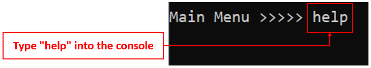

2. You should be able to see a list of available commands like the screenshot below:

    

#### 3.1.2. <a id="main-profile">Entering Profile Menu: `profile`</a>
The program will direct you to the Profile Menu.

__Format:__ `profile`
  
**Example**: 
1. Type `profile` into your console and press <kbd>Enter</kbd> to execute it.
1. If the redirection is successful, you should be able to see the message below:

    ```
        _________________________________________________________________________________________________
        Starting Profile Menu......
        _________________________________________________________________________________________________
    ```

> :bulb: You can verify that you are in Profile Menu if the text before your cursor becomes `Profile Menu >>>>>`.

> :bulb: You can return to Main Menu from Profile Menu by entering command `end`. You can refer to [Section 3.2.6. Returning to Main Menu](#profile-end) for more details.

#### 3.1.3. <a id="main-diet">Entering Diet Menu: `diet`</a>
The program will direct you to the Diet Menu.

__Format:__ `diet`  

**Example**: 
1. Type `diet` into your console and press <kbd>Enter</kbd> to execute it.

2. If the redirection is successful, you should be able to see the message below:

    ```
        _________________________________________________________________________________________________
        Starting Diet Menu...
        _________________________________________________________________________________________________
    ```

> :bulb: You can verify that you are in Diet Menu if the text before your cursor becomes `Diet Menu >>>>>`.

> :bulb: You can return to Main Menu from Diet Menu by entering command `end`. You can refer to [Section 3.3.8. Returning to Main Menu](#diet-end) for more details.

#### 3.1.4. <a id="main-workout">Entering Workout Menu: `workout`</a>
The program will direct you to the Workout Menu.

__Format:__ `workout`

**Example**: 
1. Type `workout` into your console and press <kbd>Enter</kbd> to execute it.
1. If the redirection is successful, you should be able to see the message below:

    ```
        _________________________________________________________________________________________________
        Starting Workout Menu...
        _________________________________________________________________________________________________
    ```

> :bulb: You can verify that you are in Workout Menu if the text before your cursor becomes `Workout Menu >>>>>`.

> :bulb: You can return to Main Menu from Workout Menu by entering command `end`. You can refer to [Section 3.4.8. Returning to Main Menu](#workout-end) for more details.


#### 3.1.5. <a id="main-end">Ending The Schwarzenegger: `end`</a>
You use this command when you want to terminate The Schwarzenegger.

__Format:__ `end`  

**Example**: 
1. Type `end` into your console and press <kbd>Enter</kbd> to execute it.
1. If the program exits successfully, you should be able to see the message below:

    ```
        ______________________________________________________________________________
        Bye, you have exited The Schwarzenegger.
        ______________________________________________________________________________
    ```

### 3.2. <a id="profile-menu">Profile Menu</a> [Khoa]
Profile Menu manages your profile including your name, physique data and expected daily calories intake. 

Click [here](#main-profile) to learn how to enter Profile Menu.

#### 3.2.1. <a id="profile-help">Viewing Help: `help`</a>
You can see a complete list of available commands under Profile Menu and how to use them.

__Format:__ `help`  

**Example:**
1. Type `help` into your console and press <kbd>Enter</kbd> to execute it.
2. If the execution is successful, you should be able to see the message below:

```
        _________________________________________________________________________________________________
        Add      FORMAT:      add /n [NAME] /h [HEIGHT] /w [CURRENT_WEIGHT] /e [EXPECTED_WEIGHT] /c [DAILY_CALORIE_INTAKE]
              DESCRIPTION: Add your new profile
        View     FORMAT:      view
              DESCRIPTION: View your profile
        Edit     FORMAT:      edit </n [NAME]> </h [HEIGHT]> </w [CURRENT_WEIGHT]> </e [EXPECTED_WEIGHT]> </c [DAILY_CALORIE_INTAKE]>
              DESCRIPTION: Edit your existing profile. You may edit from 1 field to all fields
        Delete   FORMAT:      delete
              DESCRIPTION: Delete your existing profile
        End      FORMAT:      end
              DESCRIPTION: Go back to Main Menu
        _________________________________________________________________________________________________
```

#### 3.2.2. <a id="profile-add">Adding a Profile: `add`</a>
You can add your profile for the most customized experience in The Schwarzenegger. Your height should in centimeters, your current weight and expected weight should be in kilograms, and your expected daily calorie intake should be in calories.

__Format:__ `add /n [NAME] /h [HEIGHT] /w [CURRENT_WEIGHT] /e [EXPECTED_WEIGHT] /c [DAILY_CALORIE_INTAKE]`  

**Example:** When you want to add your profile to the application, you follow the steps below:
1. Ensure that you are in Profile Menu.<br>
Refer to [Section 3.1.2. Entering Profile Menu](#main-profile) to learn how to enter Profile Menu.
    
    
2. Type `add /n Schwarzenegger /h 188 /w 113 /e 100 /c 2500` into your console and press <kbd>Enter</kbd> to execute it.<br>
This command adds a profile with the name Schwarzenegger, height 188 cm, weight 113 kg, expected weight 100 kg and expected daily intake of 2500 calories.

    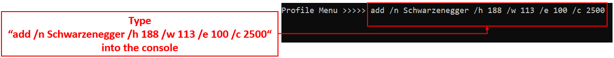

3. If the execution is successful, you should be able to see the confirmation message below:

    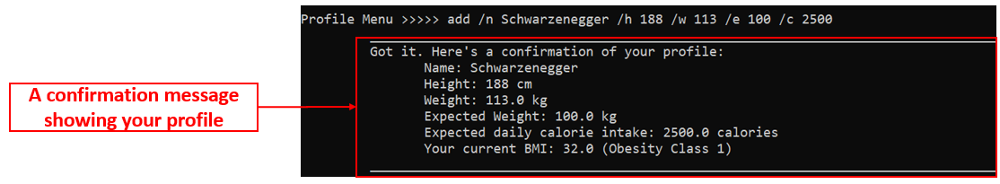

> :warning: The Schwarzenegger currently does not support names containing "/" character.

#### 3.2.3. <a id="profile-view">Viewing a Profile: `view`</a>
You can view your profile recorded in the program. The Schwarzenegger will also show the additional information below:
- Your current BMI classification so that you can have a good suggestion on your current fitness level.
- Comparison between your calorie intake today with your expected daily calorie intake.
- Suggestion on adjusting your weight expectation for better fitness where applicable. For example, if your expected weight results in the Underweight BMI classification, The Schwarzenegger will show you a tip on editing your weight expectation.

__Format:__ `view`  

**Example**:
1. Type `view` into your console and press <kbd>Enter</kbd> to execute it.
2. If the execution is successful, you should be able to see the message below:

```
     _________________________________________________________________________________________________
     Here's your profile:
            Name: Schwarzenegger
            Height: 188 cm
            Weight: 113.0 kg
            Expected Weight: 100.0 kg
            Expected daily calorie intake: 2500.0 calories
            Your current BMI: 32.0 (Obesity Class 1)
     By the way, take 2500.0 more calories to achieve your target for today!
     TIP: Edit your expected weight to 76.7 kg to have Normal Weight BMI classification.
          Just type "edit /e 76.7"!
     _________________________________________________________________________________________________
```

> :bulb: If you do not see the tip, it means that your current height and weight expectation is classified as Normal Weight already.

#### 3.2.4. <a id="profile-edit">Editing a Profile: `edit`</a>
You can edit the profile after adding to the program.

__Format:__ `edit </n [NAME]> </h [HEIGHT]> </w [WEIGHT]> </e [EXPECTED_WEIGHT]> </c [DAILY_CALORIES_INTAKE]>`  

**Example**:
- If you want to edit your height, you follow the steps below:
    1. Type `edit /h 180` into your console and press <kbd>Enter</kbd> to execute it. <br>
    This command edits your current height to 180 centimeters.
    2. If the execution is successful, you should be able to see the confirmation message below:
    
        ```
            ______________________________________________________________________________
            Yay! Your profile is edited successfully. Here's your new profile:
                Name: Schwarzenegger
                Height: 180 cm
                Weight: 113.0 kg
                Expected Weight: 100.0 kg
                Expected daily calories intake: 2500.0 calories
                Your BMI: 32.0 (Obesity Class 1)
            ______________________________________________________________________________
        ```
- If you want to edit your height and weight, you follow the steps below:
    1. Type `edit /h 180 /w 50` into your console and press <kbd>Enter</kbd> to execute it.<br>
     This command edits your current height to 180 centimeters and current weight to 50 kilograms.
    2. If the execution is successful, you should be able to see the confirmation message below:

        ```
             ______________________________________________________________________________
             Yay! Your profile is edited successfully. Here's your new profile:
                    Name: Schwarzenegger
                    Height: 180 cm
                    Weight: 50.0 kg
                    Expected Weight: 100.0 kg
                    Expected daily calories intake: 2500.0 calories
                    Your BMI: 15.4 (Underweight)
             ______________________________________________________________________________
        ```

- If you want to edit your height, weight and expected weight, you follow the steps below:
    1. Type `edit /h 180 /w 50 /e 55` into your console and press <kbd>Enter</kbd> to execute it.<br>
        This command edits your current height to 180 centimeters, current weight to 50 kilograms and expected weight to 55 kilograms.
    2. If the execution is successful, you should be able to see the confirmation message below:
    
        ```
             ______________________________________________________________________________
             Yay! Your profile is edited successfully. Here's your new profile:
                    Name: Schwarzenegger
                    Height: 180 cm
                    Weight: 50.0 kg
                    Expected Weight: 55.0 kg
                    Expected daily calories intake: 2500.0 calories
                    Your BMI: 15.4 (Underweight)
             ______________________________________________________________________________
        ```

> :bulb: You may edit from 1 field to all fields in your profile.      

#### 3.2.5. <a id="profile-delete">Deleting a Profile: `delete`</a>
You can use this command to delete your profile from our system. 

This command is dangerous as you will not be able to recover the data. After typing this command, you will be asked to reconfirm it by typing in `YES`. Any other input will abort the deletion.

__Format:__ `delete`  

**Example**:
1. Type `delete` into your console and press <kbd>Enter</kbd> to execute it.
2. Type `YES` into your console and press <kbd>Enter</kbd> to confirm the deletion.
3. If the execution is successful, you should be able to see the message below:
```    
    _________________________________________________________________________________________________
    Alright, your profile has been cleared!
    _________________________________________________________________________________________________
```
    
> :warning: Your profile data cannot be recovered once cleared!

#### 3.2.6. <a id="profile-end">Returning to Main Menu: `end`</a>
You use this command to exit Profile Menu and return to the Main Menu.

__Format:__ `end`  

**Example**:
1. Type `end` into your console and press <kbd>Enter</kbd> to execute it.
2. If the execution is successful, you should be able to see the message below:

```
    _________________________________________________________________________________________________
    Returning to Main Menu...
    _________________________________________________________________________________________________
```

### 3.3. <a id="diet-menu">Diet Menu</a> [Zeon]
Diet Menu manages your diet sessions which record food items and calories intake.

Click [here](#main-diet) to learn how to enter Diet Menu.

#### 3.3.1. <a id="diet-help">Viewing Help: `help`</a>
You can see a complete list of available commands under Diet Menu and how to use them.

__Format:__ `help`

Example: `help`

Expected outcome:

```
	 _________________________________________________________________________________________________
	 New      FORMAT:      new </d [DATE]> </t [TAG]>
	          DESCRIPTION: Create a new diet session
	 List     FORMAT:      list
	          DESCRIPTION: Show all past diet sessions
	 Delete   FORMAT:      delete [INDEX]
	          DESCRIPTION: Delete the diet session at the input index
	 Edit     FORMAT:      edit [INDEX]
	          DESCRIPTION: Edit the diet session at the input index
	 Search   FORMAT:      search </s [STARTING_DATE]> </e [END_DATE]> </t [TAG]>
	          DESCRIPTION: Search the diet session in between starting and end dates with a specific tag
	 Clear    FORMAT:      clear
	          DESCRIPTION: Clear all past diet sessions
	 End      FORMAT:      end
	          DESCRIPTION: Go back to Main Menu
	 _________________________________________________________________________________________________

```
 
#### 3.3.2. <a id="diet-start">Starting a New Diet Session: `new`</a>
You can create a new diet session with this command. The date and tag can be added on creation with "/d" for date and "/t" for meal type. 

You will be directed immediately into the new diet session. You may verify that as seen from how the cursor changes from 

`Diet Menu >>>>> `

to

```Diet Menu > New Diet Session >>>>> ```. 

__Format:__ `new </d [DATE]> </t [TAG]>`
 
Example:
- `new`<br>
This command creates a new diet session tagged as unspecified with today's date.<br>


**Example:** Whenever you want to create a new Diet Session, you follow the steps below:
1. Ensure that you are in the Diet Menu.<br>
Refer to [Section 3.1.3. Entering Diet Menu](#main-diet) to learn how to enter the Diet Menu.

    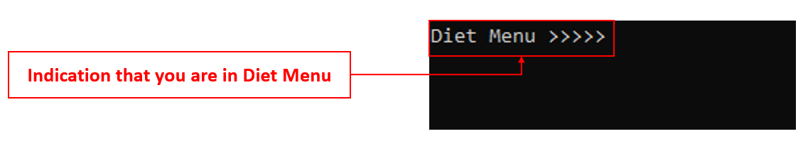

2. Type new /d 2020-11-09 /t lunch into your console and press Enter to execute it.
   This command starts a Diet Session of date 9th September 2020 with tag lunch.

    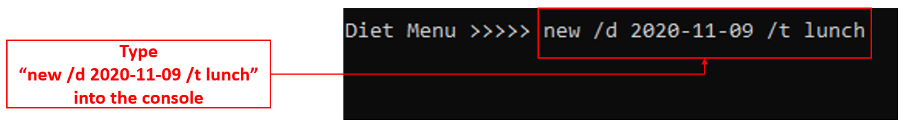

3. If the execution is successful, you should be able to see the confirmation message below.

    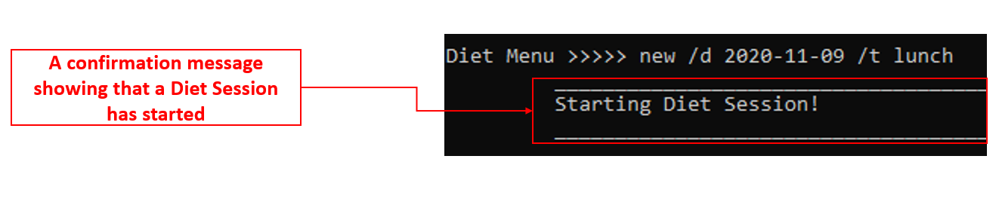

4. You will also be redirected to the Diet Session interface, as seen below.

    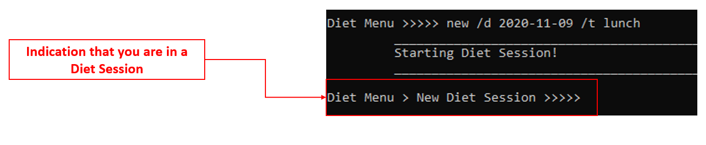


> :warning: You may choose not to add the date or tag, but diet sessions with the same date and tag will be overwritten!
  
  
#### 3.3.2.1. <a id="meal-help">Viewing Help in Diet Session: `help`</a> [Shukai]
You can see a complete list of available commands under Diet Session and how to use them.

__Format:__ `help` 

Example: `help`

Expected outcome:
```
	 _________________________________________________________________________________________________
	 Add      FORMAT:      add [FOOD_NAME] /c [CALORIES]
	          DESCRIPTION: Add a new food item
	 List     FORMAT:      list
	          DESCRIPTION: Show all food items
	 Delete   FORMAT:      delete [INDEX]
	          DESCRIPTION: Delete the food item at the input index
	 Search   FORMAT:      search [FOOD_NAME]
	          DESCRIPTION: Search the diet session for food with the name specified
	 Clear    FORMAT:      clear
	          DESCRIPTION: Clear all food items
	 End      FORMAT:      end
	          DESCRIPTION: Go back to the Diet Menu.
	 _________________________________________________________________________________________________

```
#### 3.3.2.2. <a id="meal-add">Adding Food Items to the Current Diet Session: `add`</a>
This command adds a food item into the current diet session.

__Format:__ `add [FOOD_NAME] /c [CALORIES]` 

Example: Whenever you want to add new food items in the diet session, you follow the steps below:
1. Locate yourself in the diet session menu as shown in the screenshot below:

    

2. You can add food items by following the format `add [FOOD_NAME] \c [CALORIES]` after the prompt as shown in the screenshot:

    
    
3. You should be able to see a message showing that you have added the food item like the screenshot below:

    

Expected outcome:
```
	 _________________________________________________________________________________________________
	 Yay! You have added chicken nuggets with calories: 120.0
	 _________________________________________________________________________________________________
```

> :bulb: Your calories per food item is capped at 200,000


#### 3.3.2.3. <a id="meal-list">Listing Food Items from the Current Diet Session: `list`</a>
Lists all the added food items for the current diet session, with a numbered sequence according to sequence entered.

__Format:__ `list` 

Example: `list`

Expected outcome:
```
	 _________________________________________________________________________________________________
	 Index   Food            Calories 
	 1       chicken nuggets 120.0     
	 2       fries           240.0

	 Your total calories for this meal is 360.0.
	 _________________________________________________________________________________________________
```

#### 3.3.2.4. <a id="meal-delete">Deleting Food Items from the Current Diet Session: `delete`</a>
You can remove food items from your list according to the index in the current meal session list.

__Format:__ `delete [INDEX]`

Example: `delete 1`

Expected outcome:

```
	 _________________________________________________________________________________________________
	 You have deleted chicken nuggets with calories: 120.0 from your list!
	 _________________________________________________________________________________________________

``` 
#### 3.3.2.5. <a id="meal-clear">Clearing All Food Items from the Current Diet Session: `clear`</a>
You can clear all the food items in the current diet session list.

This command is dangerous as you will not be able to recover the data. After typing this command, you will be asked to reconfirm it by typing in `YES`. Any other input will abort the clearing.

__Format:__ `clear` 

Example: `clear`

Expected outcome:
```
     _________________________________________________________________________________________________
     Are you sure you want to clear all records? This action is irrevocable.
     Key in "YES" to confirm.
     _________________________________________________________________________________________________
 
 Diet Menu > New Diet Session >>>>> YES
     _________________________________________________________________________________________________
     Oops you have cleared all the food items.
     _________________________________________________________________________________________________
```

> :warning: Your food items cannot be recovered once cleared!


#### 3.3.2.6. <a id="meal-search">Searching for Food Items from the Current Diet Session: `search`</a>
You can search for all food items that contain the word entered, in the current diet session.


__Format:__ `search [FOOD_NAME]` 

Example: `search rice`

Expected outcome:
```
Diet Menu > Diet Session 1 >>>>> search rice
	 _________________________________________________________________________________________________
	 Here are the search results: 
	 Index   Food         Calories 
	 1       chicken rice 332.0     
	 2       fried rice   452.0     
	 
	 You have 2 record(s)
	 _________________________________________________________________________________________________

```

#### 3.3.2.7. <a id="meal-end">Ending the Current Diet Session: `end`</a>
You can return to the diet menu by ending your current diet session.

__Format:__ `end` 

Example: `end`

Expected outcome:
```
	 _________________________________________________________________________________________________
	 Exiting Diet Session!
	 _________________________________________________________________________________________________

```
#### 3.3.3. <a id="diet-list">Listing All Past Diet Sessions: `list`</a> [Zeon]
You can obtain a list of information about past diet sessions together with their numbered index and calories.

__Format:__ `list`

Example: `list`

Expected outcome:
```
    _________________________________________________________________________________________________
    You have 2 records
    Index   Tags        Date        Calories
    1       dinner      2020-10-29  110.0
    2       lunch       2020-10-29  120.0
    _________________________________________________________________________________________________
```

#### 3.3.4. <a id="diet-edit">Editing a Past Diet Session: `edit`</a>
You can edit a previous diet session based on a numbered index that can be found in the `list` command.

__Format:__ `edit [INDEX]`

Example: `edit 2` 

Expected outcome:
```
	 _________________________________________________________________________________________________
	 Starting Diet Session!
	 _________________________________________________________________________________________________

Diet Menu > Diet Session 2 >>>>> 
```

> :bulb: Editing a diet session works exactly like how it does when you create a new diet session.


#### 3.3.5. <a id="diet-delete">Deleting a Past Diet Session: `delete`</a>
You can delete a previously created diet session based on a numbered index that can be found in the `list` command.

__Format:__ `delete [INDEX]`

Example: `delete 2`

Expected outcome:
```
     _________________________________________________________________________________________________
     You have deleted that diet session!
     _________________________________________________________________________________________________
```

> :warning: Deleted diet sessions cannot be recovered!


 
#### 3.3.6. <a id="diet-clear">Clearing All Past Diet Sessions: `clear`</a>
You can clear all previously saved diet sessions. 

__Format:__ `clear`

Example: `clear`

Expected outcome:
```
	 _________________________________________________________________________________________________
	 Are you sure you want to clear all records? This action is irrevocable.
	 Key in "YES" to confirm.
	 _________________________________________________________________________________________________

Diet Menu >>>>> YES
	 _________________________________________________________________________________________________
	 You have cleared all diet sessions!
	 _________________________________________________________________________________________________
```

> :warning: This command is dangerous as you will not be able to recover the data. After typing this command, you will be asked to reconfirm it by typing in `YES`. Any other input will abort the clearing.


#### 3.3.7. <a id="diet-search">Searching for Past Diet Sessions: `search`</a>
Searches for specified range of diet sessions with identifiers such as start date, end date and tags.

__Format:__ `search </s [START DATE]> </e [END DATE]> </t [TAG]>`

Example: `search /s 2020-05-06 /e 2020-05-10 /t breakfast`

Expected outcome:
```
	 _________________________________________________________________________________________________
	 Here are the search results!
	 Index   Date             Tag         Calories  
	 1       2020-05-08       breakfast   112.0
     2       2020-05-09       breakfast   250.0
	 
	 You have 2 record(s)
	 _________________________________________________________________________________________________
```

#### 3.3.8. <a id="diet-end">Returning to Main Menu: `end`</a>
You can use this command to exit Diet Menu and return to the Main Menu.

__Format:__ `end`

Example: `end`

Expected outcome:
```
	 _________________________________________________________________________________________________
	 Returning to Main Menu...
	 _________________________________________________________________________________________________

```

### 3.4. <a id="workout-menu">Workout Menu</a> [Zesong]
This section shows the command you can use when you are in workout menu.

Click [here](#main-workout) to learn how to enter Workout Menu.
#### 3.4.1. <a id="workout-help">Viewing Help: `help`</a>
You can see a complete list of available commands under Workout Menu and how to use them.

__Format:__ `help`

1. Type `help` into your console and press <kbd>Enter</kbd> to execute it.

    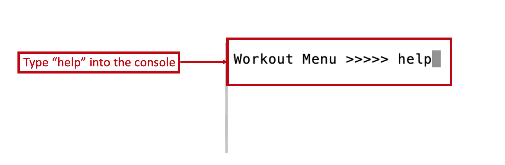

2. You should be able to see a list of available commands like the screenshot below:
    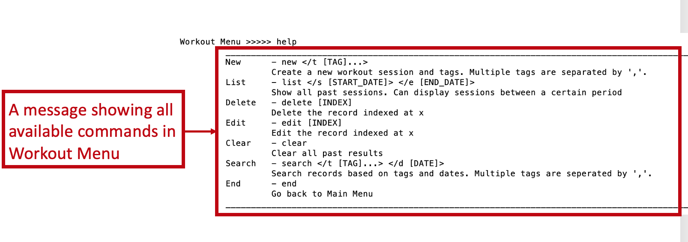


#### 3.4.2. <a id="workout-start">Starting a New Workout Session: `new`</a>
You can a new workout session and go into the session. You can add tags with “/t”. 
> :bulb: Tags are optional and more than one tag can be attached to a session.
   If you want to add more than one tags, you should separate them by `,`.
 
After <kbd>Enter</kbd>, you will be directed into workout session to manage the given session. You may verify that as seen from how the cursor changes from

`Workout Menu >>>>> `

to

```Workout Menu > New Workout Session >>>>> ```.

__Format:__ `new </t [TAG]...>`  

Example: `new /t legs day, tricep`

Expected outcome:
```
	 ______________________________________________________________________________
	 You have started a new workout session!
	 ______________________________________________________________________________

Workout Menu > New Workout Session >>>>> 
```


#### 3.4.2.1. <a id="ws-help">Viewing Help in Workout Session: `help`</a> [Jinyang]
You can see a complete list of available commands under Workout Session and how to use them.

__Format:__ `help`  

Example: `help`

Expected outcome:

```
	 _________________________________________________________________________________________________
	 Add      FORMAT:      add [NAME_OF_MOVE] /n [NUMBER_OF_REPETITIONS] /w [WEIGHT]
	          DESCRIPTION: Add a new move
	 List     FORMAT:      list
	          DESCRIPTION: Show all moves in this current session
	 Delete   FORMAT:      delete [INDEX]
	          DESCRIPTION: Delete a move according to the index in the list
	 Search   FORMAT:      search [NAME_OF_MOVE]
	          DESCRIPTION: Show a list of moves that match the entered keyword
	 End      FORMAT:      end
	          DESCRIPTION: Go back to the Workout Menu
	 _________________________________________________________________________________________________
```

#### 3.4.2.2. <a id="ws-add">Adding a Move to the Current Workout Session: `add`</a>
Adds a move with number of moves per set and weights of equipment (if the move does not require weights, input 0 for weight).

__Format:__ `add [NAME_OF_MOVE] /n [NUMBER_OF_MOVES_PER_SET] /w [WEIGHT]`  

**Example:** When you want to add an exercise to the current Workout Session, you follow the steps below:
1. Ensure that you are in a Workout Session.<br>
Refer to [Section 3.4.2. Starting a New Workout Session](#workout-start) to learn how to start a Workout Session.
    
    
2. Type `add benchpress /w 45.5 /n 6` into your console and press <kbd>Enter</kbd> to execute it.<br>
This command adds an exercise with the name benchpress, weight of 45.5 and 6 repetititons.

    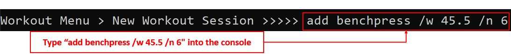

3. If the execution is successful, you should be able to see the confirmation message below:

    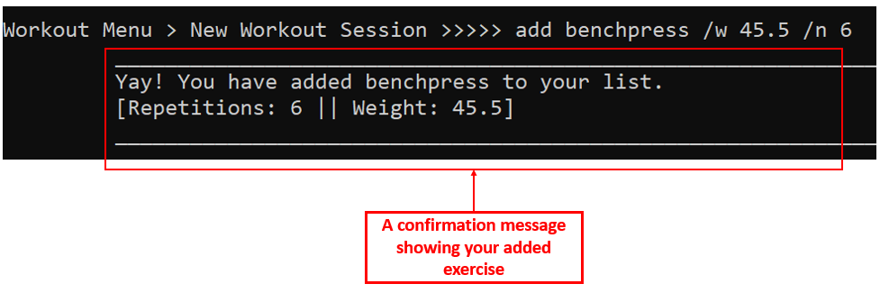

#### 3.4.2.3. <a id="ws-list">Listing All Moves from the Current Workout Session: `list`</a>
Lists all the added moves for the current workout session, with a numbered sequence according to sequence entered.

__Format:__ `list`  

Example: `list`

Expected outcome:
```
     _________________________________________________________________________________________________
     Index   Exercise             Repetitions    Weight
     1       squat                15             40.0
     _________________________________________________________________________________________________
```

#### 3.4.2.4. <a id="ws-delete">Deleting a Move From the Current Workout Session: `delete`</a>
Deletes a move according to move index in the current workout session list.

__Format:__ `delete [INDEX]`  

Example: `delete 1`

Expected outcome:

```
     _________________________________________________________________________________________________
     You have deleted squat from your list!
     [Repetitions: 15 || Weight: 40.0]
     _________________________________________________________________________________________________
```


#### 3.4.2.5. <a id="ws-search">Searching for a Keyword in the Current Workout Session: `search`</a>
Searches the current workout session for the keyword and shows the relevant data found in a neat list.

__Format:__ `search [NAME_OF_MOVE]`  

Example: `search bench`

Expected outcome:

```
     _________________________________________________________________________________________________
     	 Index   Exercise             Repetitions    Weight    
     	 1       bench                324            342.0
     	 2       benchpress           324            342.0
     	 3       bench press          324            342.0
     _________________________________________________________________________________________________
```


#### 3.4.2.6. <a id="ws-end">Ending the Current Workout Session: `end`</a> 
Ends the current workout session and saves the relevant data.

__Format:__ `end`  

Example: `end`

Expected outcome:

```
     _________________________________________________________________________________________________
     Congratulations! You have finished today's workout!
     _________________________________________________________________________________________________
```

#### 3.4.3. <a id="workout-list">Listing All Past Workout Sessions: `list`</a> [Zesong]
You can see all your past workout sessions. They will be summarised and printed in a table with their index, creation date and tags.

You can specify start date and end date to show sessions created in a selected period using `\s` for start date and `\e` for end date. If start date is not specified, it will take the earliest date a start date. If end date is not specified, it will take today as the end date.

__Format:__ `list </s [START_DATE]> </e [END_DATE]>`  

Example `list /e 20201026`

Expected outcome:
```
	 ______________________________________________________________________________
	 You have 2 records in the given period:
	 Index   Creation date   Tags    
	 1       2020-10-26      [legs day, tricep]
	 2       2020-10-26      [chest]
	 ______________________________________________________________________________
```

#### 3.4.4. <a id="workout-edit">Editing a Workout Session: `edit`</a>
You can edit a past workout session in the record list.

__Format:__ `edit [INDEX]` 

You will go into the specific workout session after typing this command. You may verify by seeing the cursor changes from 

```Workout Menu >>>>>``` 

to

```Workout Menu > Workout Session X >>>>>``` .

The index can be found by listing all results or searching the target record.

Example: `edit 1`

Expected outcome:
```
Workout Menu > Workout Session 1 >>>>> 
```

#### 3.4.5. <a id="workout-delete">Deleting a Workout Session: `delete`</a>
You can delete a past workout session in the record list.

__Format:__ `delete [INDEX]` 

The index can be found by listing the results.

Example：
`delete 1`

Expected outcome:
```
    ______________________________________________________________________________
    You have deleted that record!
    ______________________________________________________________________________
```
> :warning: Your workout session record cannot be recovered once deleted!

#### 3.4.6. <a id="workout-search">Searching a List of Workout Sessions: `search`</a>
You can search for a list of workout sessions that match certain conditions. For example, you can search for sessions created on a specific day or sessions that contain certain tags. All sessions that satisify the condition will be summaried into a table and printed out.

__Format:__ `search </d [DATE]> </t [TAG]...>`

- Tag condition

You can search records containing (a list of) tags with `/t` followed by the tags. Multiple tags should be separated by `,`. If you give multiple tags, only sessions that contains all the tags will be selected. You can search with part of the tag as well. For example searching with<br> `search /t leg` <br>will match any tags that contains `leg`, e.g. `legs`.

- Date condition

You can search records created on a specific day with `/d` followed by a date. You should key in your date following one of the supported formats. [See here](#notes) for a complete list of format supported.

Both date and tag conditions are optional. You may have zero, one or both conditions while searching. If both conditions are given, only sessions that meet both conditions will be selected.


Example: `search /t le`

Expected outcome:
```
	 ______________________________________________________________________________
	 1  records are found:
	 Index   Creation date   Tags    
	 2       2020-10-26      [legs day, tricep]
	 ______________________________________________________________________________
```

#### 3.4.7. <a id="workout-clear">Clearing All Workout Sessions: `clear`</a>
You can erase all workout sessions.

__Format:__ `clear`

Example `clear`

Expected outcome:
```
	 ______________________________________________________________________________
	 Are you sure you want to clear all records? This action is irrevocable.
	 Key in "YES" to confirm.
	 ______________________________________________________________________________

Workout Menu >>>>> YES
	 ______________________________________________________________________________
	 You have cleared all records!
	 ______________________________________________________________________________

Workout Menu >>>>> 
```
> :warning: This command is dangerous as you will not be able to recover the data. After typing this command, you will be asked to reconfirm it by typing in `YES`. Any other input will abort the clearing. 

#### 3.4.8. <a id="workout-end">Returning to Main Menu: `end`</a>

You can return to the main menu.

__Format:__ `end`

After typing in this, you will see your prompt in your terminal
changes from `Workout Menu>>>` to `Main Menu>>>`. 
 
Example `end`

Expected output
```
	 ______________________________________________________________________________
	 Returning to Main menu...
	 ______________________________________________________________________________

Main Menu >>>>> 
```

## 4. <a id="command-summary">Command Summary</a>

**Main Menu** [Khoa]

**Action** |  **Format**
--------|----------------------
Help|`help`
Profile Menu |`profile`
Diet Menu|`diet`
Workout Menu|`workout`
End|`end`

**Profile Menu** [Khoa]

**Action** |  **Format**
--------|----------------------
Help|`help`
Add |`add /n [NAME] /h [HEIGHT] /w [CURRENT_WEIGHT] /e [EXPECTED_WEIGHT] /c [DAILY_CALORIE_INTAKE]`<br><br>E.g. `add /n Schwarzenegger /h 188 /w 113 /e 100 /c 2500`
View|`view`
Edit|`edit </n [NAME]> </h [HEIGHT]> </w [CURRENT_WEIGHT]> </e [EXPECTED_WEIGHT]> </c [DAILY_CALORIE_INTAKE]>`<br><br>E.g. `edit /w 110`, `edit /h 175 /w 110`, `edit /h 175 /w 110 /e 90`
Delete|`delete`
Return to Main Menu|`end`

**Diet Menu** [Zeon]

**Action** |  **Format**
--------|----------------------
Help|`help`
Start diet session |`new </d [DATE]> </t [TAG]>`<br><br>E.g. `new /d 2020-05-04 /t breakfast`
List|`list`
Edit|`edit [INDEX]`<br><br>E.g. `edit 1`
Delete|`delete [INDEX]`<br><br>E.g. `delete 1`
Search|`search </s [STARTING_DATE]> </e [END_DATE]> </t [TAG]>`<br><br>E.g. `search /t lunch`
Clear|`clear`
Return to Main Menu|`end`

**Diet Session** [Shukai]

**Action** |  **Format**
--------|----------------------
Help|`help`
Add |`add [FOOD_NAME] /c [CALORIES]`<br><br>E.g. `add spinach /c 90`
List|`list`
Delete|`delete [INDEX]`<br><br>E.g. `delete 1`
Search|`search [FOOD_NAME]`<br><br>E.g. `search rice`
Clear|`clear`
Return to Diet Menu|`end`

**Workout Menu** [Zesong]

**Action** |  **Format**
--------|----------------------
Help|`help`
Start workout session |`new </t [TAG]...>`<br><br>E.g. `new /t leg, chest`
List|`list </s [START_DATE]> </e [END_DATE]>`<br><br>E.g. `list /s 20201001 /e 2020/10/25`
Edit|`edit <INDEX>`<br><br>E.g. `edit 1`
Delete|`delete [INDEX]`<br><br>E.g. `delete 1`
Search|`search </t [TAG]...> </d [DATE]>`<br><br>E.g. `search /t leg day, chest /d 2020-10-18`
Clear|`clear`
Return to Main Menu|`end`

**Workout Session** [Jinyang]

**Action** | **Format**
--------|----------------------
Help|`help`
Add |`add [NAME_OF_MOVE] /n [NUMBER_OF_REPETITIONS] /w [WEIGHT]`<br><br>E.g. `add squat /n 15 /w 40`
List|`list`
Delete|`delete [INDEX]`<br><br>E.g. `delete 1`
Search|`search [NAME_OF_MOVE]`<br><br>E.g. `search bench`
Return to Workout Menu|`end`

## 5. <a id="notes">Notes</a> [Zesong]

[1] Here shows all 12 valid formats.
    
    `yyyyMMdd HH:mm`
    `yyyy-MM-dd HH:mm`
    `yyyy MM dd HH:mm`
    
    `yyyyMMdd HHmm`
    `yyyy-MM-dd HHmm`
    `yyyy MM dd HHmm`
    
    `yyyyMMdd`
    `yyyy-MM-dd`
    `yyyy MM dd`
    
    `dd MM yyyy`
    `ddMMyyyy`
    `dd-MM-yyyy`

## 6. <a id="faq">FAQ</a> [Khoa]
Below are the answers to some frequently asked questions about The Schwarzenegger:

**Q**: Can I use The Schwarzenegger on another operating systems apart from Windows?<br>
**A**: Yes. The Schwarzenegger is compatible with Windows, MacOS and Linux.

**Q**: How do I transfer my data to another Computer?<br>
**A**: Install The Schwarzenegger in the other computer and overwrite the `saves` folder it creates with the `saves` folder of your previous The Schwarzenegger.

**Q**: Can I exit The Schwarzenegger without typing `end` command?<br>
**A**: Yes. Your data is saved automatically to `saves` folder whenever it changes. Therefore, you can exit The Schwarzenegger worry-free.
